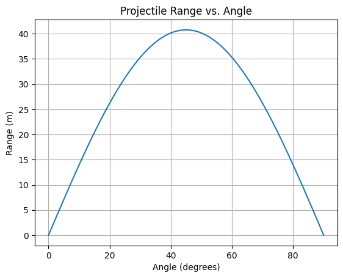

# Problem 1
# Investigating the Range as a Function of the Angle of Projection

## 1. Motivation
Projectile motion is a fundamental concept in physics with applications in sports, engineering, and astrophysics. This study explores how the range of a projectile depends on the angle of projection.

## 2. Key Equations  

### Equations of Motion  
- **Horizontal position:**  
  $ x(t) = v_0 \cos(\theta) t $

- **Vertical position:**  
  $ y(t) = v_0 \sin(\theta) t - \frac{1}{2} g t^2 $

### Time of Flight  
$$ T = \frac{2 v_0 \sin(\theta)}{g} $$

### Maximum Height  
$$ H = \frac{(v_0 \sin(\theta))^2}{2g} $$

### Horizontal Range  
$$ R = \frac{v_0^2 \sin(2\theta)}{g} $$

The maximum range occurs at:  
$$ \theta = 45^\circ $$


## 3. Range Analysis
- **Angle Effect**: Range is maximized at \( 45^\circ \) and symmetric around it.
- **Initial Velocity**: Range increases quadratically with \( v_0 \).
- **Gravity**: Higher \( g \) reduces the range.

## 4. Applications
- **Sports**: Optimizing throw angles in games.
- **Engineering**: Ballistic trajectory predictions.
- **Space Science**: Rocket launch calculations.

## 5. Python Simulation
```python
import numpy as np
import matplotlib.pyplot as plt

def projectile_range(v0, theta, g=9.81):
    theta_rad = np.radians(theta)
    return (v0 ** 2) * np.sin(2 * theta_rad) / g

v0 = 20  # m/s
theta_values = np.linspace(0, 90, 100)
ranges = [projectile_range(v0, theta) for theta in theta_values]

plt.plot(theta_values, ranges)
plt.xlabel('Angle (degrees)')
plt.ylabel('Range (m)')
plt.title('Projectile Range vs. Angle')
plt.grid()
plt.show()
```


## 6. Results & Discussion
The simulation confirms that range is maximized at \( 45^\circ \). The relationship is symmetric, meaning \( 30^\circ \) and \( 60^\circ \) yield the same range.

### Limitations
- No air resistance, wind, or uneven terrain considered.

### Extensions
- Adding drag forces for real-world accuracy.
- Studying projectile motion in different gravity environments.

## 7. Conclusion
Projectile range depends on the angle, velocity, and gravity. While an idealized model is useful, real-world conditions require further refinement.

