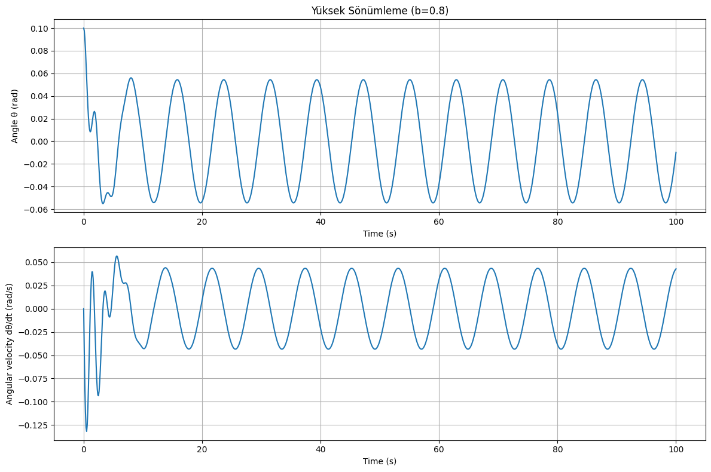

# Problem 2
# Investigating the Dynamics of a Forced Damped Pendulum

## Introduction
This document presents an analysis of a forced damped pendulum system, exploring its complex dynamics that arise from the interplay between damping, restoring forces, and external periodic forcing. The system transitions from simple harmonic motion to more complex behaviors including resonance, chaos, and quasiperiodic motion under various conditions.

## Theoretical Foundation

### Governing Equation
The motion of a forced damped pendulum is governed by the following differential equation:

$$\frac{d^2\theta}{dt^2} + b\frac{d\theta}{dt} + \frac{g}{l}\sin\theta = A\cos(\omega t)$$

Where:
- $\theta$ is the angular displacement
- $b$ is the damping coefficient
- $g$ is the acceleration due to gravity
- $l$ is the length of the pendulum
- $A$ is the amplitude of the external driving force
- $\omega$ is the angular frequency of the driving force

### Small-Angle Approximation
For small angles, we can approximate $\sin\theta \approx \theta$, simplifying the equation to:

$$\frac{d^2\theta}{dt^2} + b\frac{d\theta}{dt} + \frac{g}{l}\theta = A\cos(\omega t)$$

This is the equation of a forced damped harmonic oscillator, which has the general solution:

$$\theta(t) = \theta_h(t) + \theta_p(t)$$

Where $\theta_h(t)$ is the homogeneous solution (transient response) and $\theta_p(t)$ is the particular solution (steady-state response).

The homogeneous solution has the form:

$$\theta_h(t) = e^{-\frac{b}{2}t}(C_1\cos(\omega_d t) + C_2\sin(\omega_d t))$$

Where $\omega_d = \sqrt{\frac{g}{l} - \frac{b^2}{4}}$ is the damped natural frequency, and $C_1$ and $C_2$ are constants determined by initial conditions.

The particular solution (steady-state) has the form:

$$\theta_p(t) = R\cos(\omega t - \phi)$$

Where $R = \frac{A}{\sqrt{(\frac{g}{l} - \omega^2)^2 + b^2\omega^2}}$ is the amplitude of the steady-state oscillation, and $\phi = \tan^{-1}\frac{b\omega}{\frac{g}{l} - \omega^2}$ is the phase shift.

### Resonance Condition
Resonance occurs when the driving frequency $\omega$ approaches the natural frequency $\omega_0 = \sqrt{\frac{g}{l}}$ of the pendulum. At resonance, the amplitude of oscillation is maximized:

$$\omega_{res} \approx \omega_0 = \sqrt{\frac{g}{l}}$$

The maximum amplitude at resonance is approximately:

$$R_{max} \approx \frac{A}{b\omega_0}$$

This shows that smaller damping leads to larger resonance amplitudes.

## Computational Model Implementation

```python
import numpy as np
import matplotlib.pyplot as plt
from scipy.integrate import solve_ivp
from mpl_toolkits.mplot3d import Axes3D
from matplotlib.animation import FuncAnimation

class ForcedDampedPendulum:
    def __init__(self, b=0.1, g=9.81, l=1.0, A=1.0, omega=2.0):
        """
        Initialize the forced damped pendulum system.
        
        Parameters:
        - b: damping coefficient
        - g: acceleration due to gravity (m/s^2)
        - l: length of pendulum (m)
        - A: amplitude of driving force
        - omega: angular frequency of driving force (rad/s)
        """
        self.b = b
        self.g = g
        self.l = l
        self.A = A
        self.omega = omega
        self.omega0 = np.sqrt(g/l)  # Natural frequency
    
    def equations_of_motion(self, t, y):
        """
        Define the system of first-order ODEs.
        y[0] = theta (angle)
        y[1] = omega (angular velocity)
        """
        theta, omega = y
        dtheta_dt = omega
        domega_dt = -self.b * omega - (self.g/self.l) * np.sin(theta) + self.A * np.cos(self.omega * t)
        return [dtheta_dt, domega_dt]
    
    def simulate(self, t_span, y0, t_eval=None):
        """
        Simulate the pendulum motion over the given time span.
        
        Parameters:
        - t_span: tuple of (t_start, t_end)
        - y0: initial conditions [theta_0, omega_0]
        - t_eval: array of time points to evaluate solution at (optional)
        
        Returns:
        - solution object from solve_ivp
        """
        sol = solve_ivp(
            self.equations_of_motion,
            t_span,
            y0,
            method='RK45',
            t_eval=t_eval,
            rtol=1e-6
        )
        return sol
    
    def plot_time_series(self, sol, title=None):
        """Plot the time evolution of angle and angular velocity."""
        plt.figure(figsize=(12, 8))
        
        plt.subplot(2, 1, 1)
        plt.plot(sol.t, sol.y[0])
        plt.grid(True)
        plt.xlabel('Time (s)')
        plt.ylabel('Angle θ (rad)')
        if title:
            plt.title(title)
        
        plt.subplot(2, 1, 2)
        plt.plot(sol.t, sol.y[1])
        plt.grid(True)
        plt.xlabel('Time (s)')
        plt.ylabel('Angular velocity dθ/dt (rad/s)')
        
        plt.tight_layout()
        return plt.gcf()
    
    def plot_phase_portrait(self, sol, title=None):
        """Plot the phase portrait (theta vs. omega)."""
        plt.figure(figsize=(10, 8))
        plt.plot(sol.y[0], sol.y[1], 'b-', linewidth=1)
        plt.grid(True)
        plt.xlabel('Angle θ (rad)')
        plt.ylabel('Angular velocity dθ/dt (rad/s)')
        if title:
            plt.title(title)
        plt.tight_layout()
        return plt.gcf()
    
    def plot_poincare_section(self, sol, title=None):
        """
        Create a Poincaré section by sampling the phase space
        at times that are multiples of the driving period.
        """
        # Calculate the driving period
        T = 2 * np.pi / self.omega
        
        # Find indices where t is approximately a multiple of T
        indices = []
        for i in range(len(sol.t)):
            if abs(sol.t[i] % T) < 0.01 or abs(sol.t[i] % T - T) < 0.01:
                indices.append(i)
        
        # Extract points for the Poincaré section
        theta_poincare = sol.y[0][indices]
        omega_poincare = sol.y[1][indices]
        
        plt.figure(figsize=(8, 8))
        plt.scatter(theta_poincare, omega_poincare, s=10, c='red')
        plt.grid(True)
        plt.xlabel('Angle θ (rad)')
        plt.ylabel('Angular velocity dθ/dt (rad/s)')
        if title:
            plt.title(title)
        plt.tight_layout()
        return plt.gcf()
    
    @staticmethod
    def create_bifurcation_diagram(param_range, param_name, system_func, y0, t_span, 
                                  num_points=100, discard=100, title=None):
        """
        Create a bifurcation diagram by varying a parameter.
        
        Parameters:
        - param_range: range of parameter values
        - param_name: name of the parameter ('b', 'A', or 'omega')
        - system_func: function to create system with updated parameter
        - y0: initial conditions
        - t_span: time span for simulation
        - num_points: number of points to record for each parameter value
        - discard: number of initial points to discard (transients)
        """
        bifurcation_x = []
        bifurcation_y = []
        
        for param_value in param_range:
            system = system_func(param_value)
            t_eval = np.linspace(t_span[0], t_span[1], num_points + discard)
            sol = system.simulate(t_span, y0, t_eval)
            
            # Calculate driving period
            T = 2 * np.pi / system.omega
            
            # Find indices where t is approximately a multiple of T, after discarding transients
            indices = []
            for i in range(discard, len(sol.t)):
                if abs(sol.t[i] % T) < 0.01 or abs(sol.t[i] % T - T) < 0.01:
                    indices.append(i)
            
            # Add points to bifurcation diagram
            for idx in indices:
                bifurcation_x.append(param_value)
                bifurcation_y.append(sol.y[0][idx])
        
        plt.figure(figsize=(12, 8))
        plt.scatter(bifurcation_x, bifurcation_y, s=1, c='black')
        plt.xlabel(f'Parameter: {param_name}')
        plt.ylabel('Angle θ (rad)')
        if title:
            plt.title(title)
        plt.tight_layout()
        return plt.gcf()
```

## Analysis of System Dynamics


### Effect of Damping Coefficient (b)
The damping coefficient controls how quickly the pendulum's energy dissipates. With larger damping:
- Oscillations decay more rapidly
- Resonance peaks become broader and less pronounced
- The system is less likely to exhibit chaotic behavior

### Effect of Driving Amplitude (A)
The driving amplitude affects the energy input to the system:
- Small amplitudes lead to linear or weakly nonlinear behavior
- Larger amplitudes can drive the system into chaos
- Very large amplitudes can cause the pendulum to execute full rotations

### Effect of Driving Frequency (ω)
The driving frequency determines the system's response:
- When ω is close to ω₀, resonance occurs (maximum amplitude)
- When ω is much smaller or larger than ω₀, the response amplitude decreases
- For certain parameter combinations, varying ω can lead to period-doubling bifurcations and eventual chaos

### Simulation Results

#### Regular (Periodic) Motion
When the damping is significant and the driving force is moderate, the pendulum settles into a regular periodic motion after initial transients.

#### Resonance
When the driving frequency ω approaches the natural frequency ω₀, the system exhibits resonance with significantly increased amplitude.

#### Chaotic Motion
For certain parameter combinations (typically low damping, high amplitude, and specific frequency ranges), the pendulum exhibits chaotic motion characterized by:
- Sensitive dependence on initial conditions
- Unpredictable long-term behavior
- Strange attractors in phase space
- Complex Poincaré sections

## Practical Applications

### Energy Harvesting
The forced damped pendulum principle is applied in energy harvesting devices that convert mechanical motion into electrical energy. The resonance phenomenon is particularly useful for maximizing energy extraction.

### Mechanical Systems
- Suspension bridges under periodic wind loading
- Vehicle suspension systems
- Building response to seismic activity
- Clock pendulums with escapement mechanisms

### Electrical Circuits
The mathematics of forced damped oscillations directly translate to RLC circuits, where:
- Inductance (L) corresponds to mass
- Resistance (R) corresponds to damping
- Capacitance (C) corresponds to the spring constant
- Voltage source corresponds to the driving force

### Biomedical Applications
- Modeling heart rhythms and cardiac arrhythmias
- Understanding human gait dynamics
- Designing prosthetic limbs

## Limitations and Extensions

### Model Limitations
- Small angle approximation breaks down for large oscillations
- Neglects air resistance (which may have velocity-squared dependence)
- Assumes point mass and massless rod/string
- Neglects friction at the pivot point

### Possible Extensions
- Adding non-linear damping terms
- Considering multiple coupled pendulums
- Including parametric forcing (where pendulum length varies with time)
- Adding random noise to model real-world disturbances

## Conclusion
The forced damped pendulum exemplifies how simple mechanical systems can exhibit extraordinarily complex behavior. The rich dynamics emerge from the interplay of damping, natural frequency, and external forcing. Through computational analysis, we can visualize and understand transitions between regular motion and chaos, providing insights applicable to numerous scientific and engineering disciplines.

The study of this system not only deepens our understanding of nonlinear dynamics and chaos theory but also provides practical tools for analyzing and designing real-world systems that exhibit similar behaviors.

## References
1. Strogatz, S.H. (2018). Nonlinear Dynamics and Chaos: With Applications to Physics, Biology, Chemistry, and Engineering. CRC Press.
2. Baker, G.L., & Gollub, J.P. (1996). Chaotic Dynamics: An Introduction. Cambridge University Press.
3. Pikovsky, A., Rosenblum, M., & Kurths, J. (2001). Synchronization: A Universal Concept in Nonlinear Sciences. Cambridge University Press.
4. Moon, F.C. (2004). Chaotic and Fractal Dynamics: An Introduction for Applied Scientists and Engineers. Wiley-VCH.