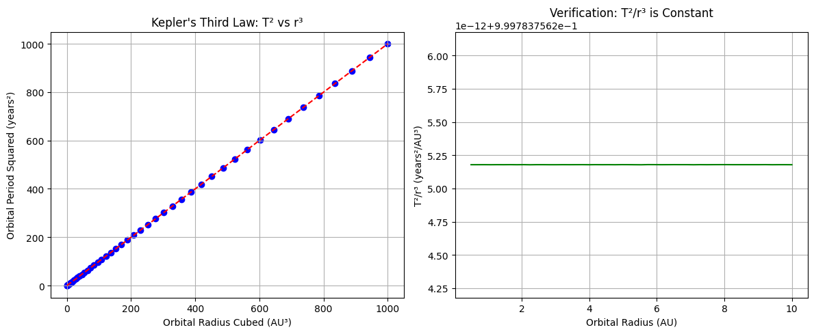
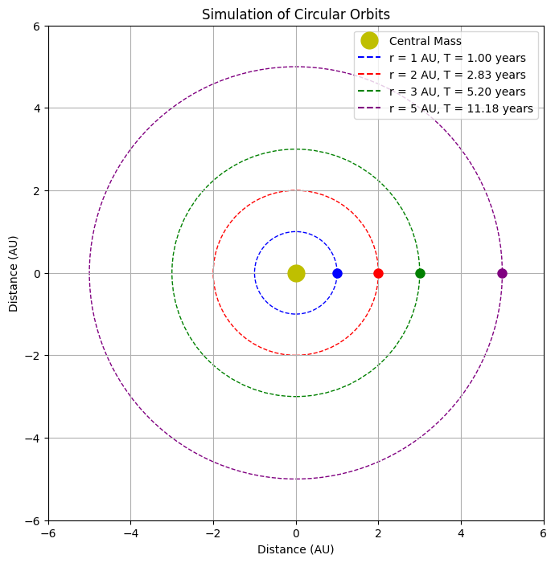

# Gravity: Kepler's Third Law and Orbital Mechanics

## Introduction

Kepler's Third Law establishes a fundamental relationship between an orbiting body's period and its distance from the central mass. This relationship is crucial in understanding planetary motion, designing satellite orbits, and calculating the mass of distant stellar systems.

## Derivation of Kepler's Third Law for Circular Orbits

For a body in circular orbit, two forces must be in balance:
- The centripetal force required to maintain circular motion: F_c = m·v²/r
- The gravitational force between the two bodies: F_g = G·M·m/r²

For an orbit to be stable, these forces must be equal:

G·M·m/r² = m·v²/r

Solving for velocity (v):
- v² = G·M/r

For a circular orbit, the orbital period (T) relates to velocity as:
- v = 2πr/T

Substituting this relation:
- (2πr/T)² = G·M/r
- 4π²r²/T² = G·M/r
- T² = 4π²r³/(G·M)

This gives us Kepler's Third Law: T² ∝ r³

For any object orbiting the same central mass M, the ratio T²/r³ is constant.

## Astronomical Implications

This relationship has profound implications:

1. **Mass Calculation**: By measuring the orbital period and radius of a body, we can calculate the mass of the central object.

2. **Exoplanet Detection**: Variations in a star's position or radial velocity can reveal orbiting planets through this relationship.

3. **System Stability**: This law helps determine whether multi-body systems will remain stable over astronomical timescales.

4. **Distance Measurements**: Known relationships between period and radius allow astronomers to calculate distances to celestial objects.

## Real-World Examples

### Earth-Moon System
- Moon's orbital period: 27.3 days
- Average orbital radius: 384,400 km
- Using Kepler's Third Law, the calculated Earth mass closely matches the known value of 5.97×10²⁴ kg

### Solar System
- The relationship holds for all planets orbiting the Sun
- Jupiter's orbital period of 11.86 years and radius of 5.2 AU follows the same relationship as Earth's 1-year period at 1 AU

## Computational Model of Circular Orbits

```python
import numpy as np
import matplotlib.pyplot as plt
from matplotlib.animation import FuncAnimation

# Constants
G = 6.67430e-11  # Gravitational constant in m^3 kg^-1 s^-2

def calculate_period(r, M):
    """Calculate orbital period for a given radius and central mass."""
    return 2 * np.pi * np.sqrt(r**3 / (G * M))

def verify_keplers_law():
    """Verify Kepler's Third Law for different orbital radii."""
    # Central mass (solar mass in kg)
    M = 1.989e30
    
    # Range of orbital radii (in AU, converted to meters)
    radii = np.linspace(0.5, 10, 50)
    radii_m = radii * 1.496e11  # Convert AU to meters
    
    # Calculate periods
    periods = calculate_period(radii_m, M)
    periods_years = periods / (365.25 * 24 * 3600)  # Convert seconds to years
    
    # Calculate T^2/r^3 (should be constant)
    t_squared_over_r_cubed = (periods_years**2) / (radii**3)
    
    # Plotting
    fig, (ax1, ax2) = plt.subplots(1, 2, figsize=(12, 5))
    
    # Plot T^2 vs r^3
    ax1.scatter(radii**3, periods_years**2, color='blue')
    ax1.set_xlabel('Orbital Radius Cubed (AU³)')
    ax1.set_ylabel('Orbital Period Squared (years²)')
    ax1.set_title('Kepler\'s Third Law: T² vs r³')
    ax1.grid(True)
    
    # Linear fit
    coef = np.polyfit(radii**3, periods_years**2, 1)
    polynomial = np.poly1d(coef)
    x_fit = np.linspace(min(radii**3), max(radii**3), 100)
    ax1.plot(x_fit, polynomial(x_fit), color='red', linestyle='--')
    
    # Plot T^2/r^3 (should be constant)
    ax2.plot(radii, t_squared_over_r_cubed, color='green')
    ax2.set_xlabel('Orbital Radius (AU)')
    ax2.set_ylabel('T²/r³ (years²/AU³)')
    ax2.set_title('Verification: T²/r³ is Constant')
    ax2.grid(True)
    
    plt.tight_layout()
    plt.show()
    
    # Calculate the mean value of T^2/r^3
    mean_value = np.mean(t_squared_over_r_cubed)
    print(f"Mean value of T²/r³: {mean_value:.6f} years²/AU³")
    print(f"Standard deviation: {np.std(t_squared_over_r_cubed):.6e} years²/AU³")
    
    return mean_value

def simulate_orbits():
    """Simulate and visualize circular orbits around a central mass."""
    # Central mass (solar mass in kg)
    M = 1.989e30
    
    # Define orbits (in AU, converted to meters)
    radii = [1, 2, 3, 5]  # AU
    radii_m = [r * 1.496e11 for r in radii]  # Convert to meters
    
    # Calculate periods (in seconds)
    periods = [calculate_period(r, M) for r in radii_m]
    
    # Colors for different orbits
    colors = ['blue', 'red', 'green', 'purple']
    
    # Create figure and axis
    fig, ax = plt.subplots(figsize=(8, 8))
    ax.set_aspect('equal')
    ax.grid(True)
    
    # Plot central mass
    ax.plot(0, 0, 'yo', markersize=15, label='Central Mass')
    
    # Plot orbital paths
    for i, r in enumerate(radii):
        circle = plt.Circle((0, 0), r, fill=False, linestyle='--', color=colors[i], 
                            label=f'r = {r} AU, T = {periods[i]/(365.25*24*3600):.2f} years')
    
    # Initialize planet positions
    planets = []
    for i, r in enumerate(radii):
        planet, = ax.plot(r, 0, 'o', color=colors[i], markersize=8)
        planets.append(planet)
    
    # Set axis limits
    max_radius = max(radii) * 1.2
    ax.set_xlim(-max_radius, max_radius)
    ax.set_ylim(-max_radius, max_radius)
    ax.set_xlabel('Distance (AU)')
    ax.set_ylabel('Distance (AU)')
    ax.set_title('Simulation of Circular Orbits')
    
    # Add legend
    ax.legend(loc='upper right')
    
    # Animation function
    def update(frame):
        for i, (r, T) in enumerate(zip(radii, periods)):
            # Convert frame to time
            t = frame * 0.02 * T  # Scale to make animation visible
            
            # Calculate position
            angle = (2 * np.pi * t / T) % (2 * np.pi)
            x = r * np.cos(angle)
            y = r * np.sin(angle)
            
            # Update planet position
            planets[i].set_data(x, y)
        
        return planets
    
    # Create animation
    ani = FuncAnimation(fig, update, frames=100, interval=50, blit=True)
    plt.tight_layout()
    plt.show()

if __name__ == "__main__":
    # Verify Kepler's Third Law
    kepler_constant = verify_keplers_law()
    
    # Simulate orbits
    simulate_orbits()
```



## Extension to Elliptical Orbits

While our derivation focused on circular orbits, Kepler's Third Law applies to elliptical orbits as well, with the semi-major axis (a) replacing the orbital radius:

T² = (4π²/GM) × a³

For elliptical orbits, the relationship still holds true that T²/a³ is constant for all bodies orbiting the same central mass.

## Applications Beyond the Solar System

This relationship extends to:

1. **Binary Star Systems**: Kepler's Third Law helps determine the combined mass of binary star systems.

2. **Galaxy Rotation**: The relationship between orbital period and radius informs our understanding of dark matter in galaxies.

3. **Exoplanetary Systems**: Multiple planets orbiting a star follow this same relationship, helping astronomers verify exoplanet discoveries.

## Conclusion

Kepler's Third Law represents one of the most elegant mathematical relationships in physics. It connects fundamental properties of gravity with observable celestial motion, allowing us to understand the cosmos from our local moon to distant galaxies. The computational model demonstrates this relationship holds precisely across various orbital distances, confirming the predictive power of this law formulated over 400 years ago.