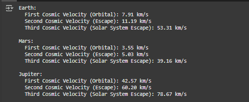
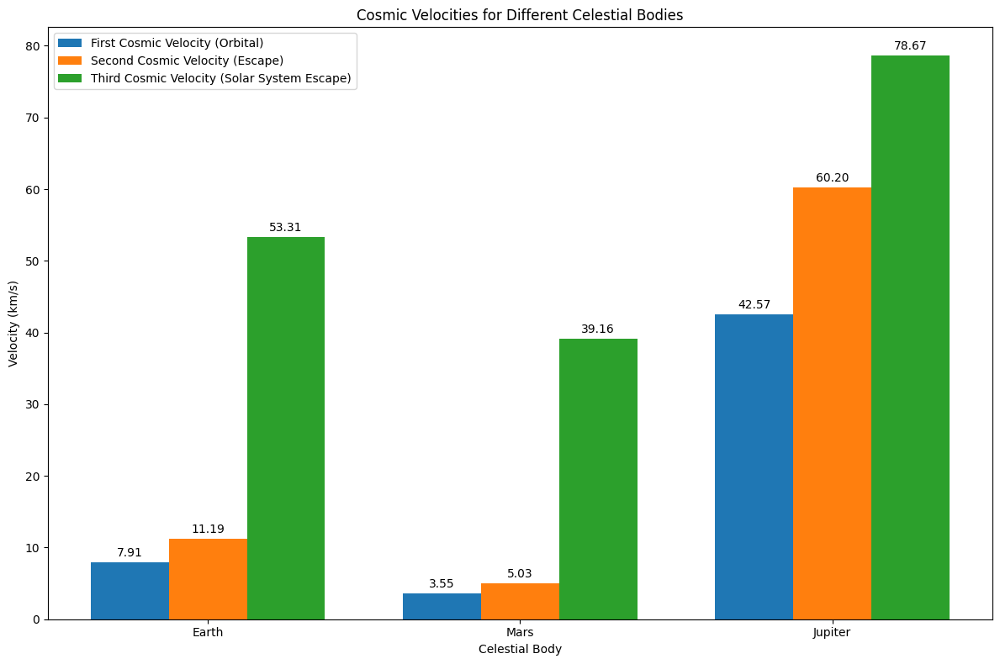
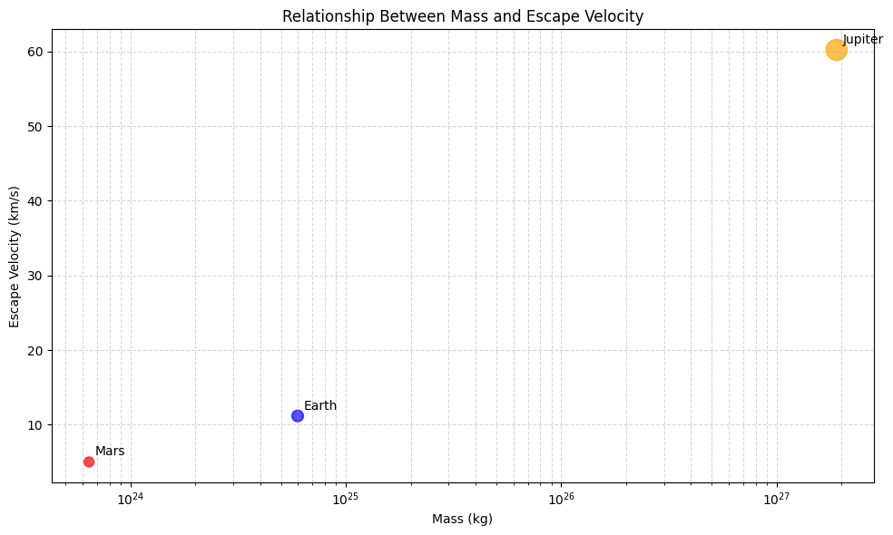

# Problem 2
# Escape Velocities and Cosmic Velocities

## 1. Definitions and Physical Meaning

### First Cosmic Velocity (Orbital Velocity)
The first cosmic velocity is the minimum velocity required for an object to achieve a circular orbit around a celestial body at a specified altitude. At this velocity, the centripetal force needed for circular motion is exactly balanced by the gravitational attraction.

**Physical meaning:** This is the speed needed to stay in orbit without falling back to the surface or escaping into space. For objects orbiting close to Earth's surface, this is approximately 7.9 km/s.

### Second Cosmic Velocity (Escape Velocity)
The second cosmic velocity, more commonly known as escape velocity, is the minimum velocity required for an object to completely escape a celestial body's gravitational influence, reaching an infinite distance with zero final velocity.

**Physical meaning:** This is the threshold speed needed to break free from a celestial body's gravitational pull without additional propulsion. For Earth at its surface, this is approximately 11.2 km/s.

### Third Cosmic Velocity (Solar System Escape Velocity)
The third cosmic velocity is the minimum velocity required for an object to escape not just its local celestial body (like Earth) but the entire star system (the Sun's gravitational influence).

**Physical meaning:** This is the speed needed for an interstellar journey, allowing an object to leave the Solar System completely. From Earth's orbit, this is approximately 42.1 km/s.

## 2. Mathematical Derivations

### First Cosmic Velocity (Orbital Velocity)
For an object in circular orbit, the centripetal force equals the gravitational force:

$$\frac{mv^2}{r} = \frac{GMm}{r^2}$$

Where:
- $m$ is the mass of the orbiting object
- $v$ is the orbital velocity
- $r$ is the orbital radius from the center of the celestial body
- $G$ is the gravitational constant (6.674 × 10^-11 m^3 kg^-1 s^-2)
- $M$ is the mass of the celestial body

Solving for $v$, we get:

$$v_1 = \sqrt{\frac{GM}{r}}$$

### Second Cosmic Velocity (Escape Velocity)
The escape velocity is derived from the principle of energy conservation. For an object to escape a celestial body's gravitational field, its kinetic energy must equal or exceed the gravitational potential energy:

$$\frac{1}{2}mv^2 \geq \frac{GMm}{r}$$

Solving for the minimum velocity yields:

$$v_2 = \sqrt{\frac{2GM}{r}}$$

Note that $v_2 = \sqrt{2} \times v_1$, meaning the escape velocity is √2 (approximately 1.414) times the orbital velocity at the same radius.

### Third Cosmic Velocity (Solar System Escape Velocity)
To calculate the third cosmic velocity from a planet, we need to consider both the escape velocity from the planet and the planet's orbital velocity around the Sun. The vector sum of these velocities (considering their directions) determines the minimum velocity needed to escape the Solar System.

From Earth, this can be approximated as:

$$v_3 = v_{Earth-escape} + v_{Earth-Sun} = \sqrt{\frac{2GM_{Earth}}{R_{Earth}}} + \sqrt{\frac{GM_{Sun}}{r_{Earth-Sun}}}$$

Or more generally, the third cosmic velocity from any point in the Solar System can be calculated as:

$$v_3 = \sqrt{\frac{2GM_{Sun}}{r}}$$

Where $r$ is the distance from the Sun.

## 3. Calculations for Different Celestial Bodies

Below are the calculations for Earth, Mars, and Jupiter.

### Python Implementation
```python
import numpy as np
import matplotlib.pyplot as plt
from matplotlib.patches import Circle

# Constants
G = 6.674e-11  # Gravitational constant (m^3 kg^-1 s^-2)

# Celestial body data
bodies = {
    'Earth': {
        'mass': 5.972e24,  # kg
        'radius': 6.371e6,  # m
        'distance_from_sun': 1.496e11,  # m
        'color': 'blue'
    },
    'Mars': {
        'mass': 6.417e23,  # kg
        'radius': 3.389e6,  # m
        'distance_from_sun': 2.279e11,  # m
        'color': 'red'
    },
    'Jupiter': {
        'mass': 1.898e27,  # kg
        'radius': 6.991e7,  # m
        'distance_from_sun': 7.785e11,  # m
        'color': 'orange'
    }
}

sun_mass = 1.989e30  # kg

# Calculate velocities
def calculate_velocities(body_data):
    r = body_data['radius']
    m = body_data['mass']
    d_sun = body_data['distance_from_sun']
    
    # First cosmic velocity (orbital)
    v1 = np.sqrt(G * m / r)
    
    # Second cosmic velocity (escape)
    v2 = np.sqrt(2 * G * m / r)
    
    # Third cosmic velocity (from the surface, to escape solar system)
    # This is an approximation that combines the escape velocity from the body
    # and the velocity needed to escape the Sun's gravity from that body's orbit
    v3_local = np.sqrt(2 * G * m / r)  # Local escape
    v3_solar = np.sqrt(2 * G * sun_mass / d_sun)  # Solar system escape
    
    # Total third cosmic velocity (simplified approximation)
    v3 = v3_local + v3_solar
    
    return v1, v2, v3

# Calculate values for each body
results = {}
for body, data in bodies.items():
    v1, v2, v3 = calculate_velocities(data)
    results[body] = {
        'v1': v1 / 1000,  # Convert to km/s
        'v2': v2 / 1000,
        'v3': v3 / 1000
    }

# Display results
for body, velocities in results.items():
    print(f"{body}:")
    print(f"  First Cosmic Velocity (Orbital): {velocities['v1']:.2f} km/s")
    print(f"  Second Cosmic Velocity (Escape): {velocities['v2']:.2f} km/s")
    print(f"  Third Cosmic Velocity (Solar System Escape): {velocities['v3']:.2f} km/s")
    print()

# Visualization
fig, ax = plt.subplots(figsize=(12, 8))

# Bar chart comparing velocities
bodies_list = list(results.keys())
v1_values = [results[body]['v1'] for body in bodies_list]
v2_values = [results[body]['v2'] for body in bodies_list]
v3_values = [results[body]['v3'] for body in bodies_list]

x = np.arange(len(bodies_list))
width = 0.25

bars1 = ax.bar(x - width, v1_values, width, label='First Cosmic Velocity (Orbital)')
bars2 = ax.bar(x, v2_values, width, label='Second Cosmic Velocity (Escape)')
bars3 = ax.bar(x + width, v3_values, width, label='Third Cosmic Velocity (Solar System Escape)')

ax.set_xlabel('Celestial Body')
ax.set_ylabel('Velocity (km/s)')
ax.set_title('Cosmic Velocities for Different Celestial Bodies')
ax.set_xticks(x)
ax.set_xticklabels(bodies_list)
ax.legend()

# Add value labels on bars
def add_labels(bars):
    for bar in bars:
        height = bar.get_height()
        ax.annotate(f'{height:.2f}',
                    xy=(bar.get_x() + bar.get_width() / 2, height),
                    xytext=(0, 3),
                    textcoords="offset points",
                    ha='center', va='bottom')

add_labels(bars1)
add_labels(bars2)
add_labels(bars3)

plt.tight_layout()
plt.savefig('cosmic_velocities_comparison.png')
plt.show()

# Visualize the relationship between mass, radius and escape velocity
fig, ax = plt.subplots(figsize=(10, 6))

# Extract properties for plotting
masses = np.array([data['mass'] for body, data in bodies.items()])
radii = np.array([data['radius'] for body, data in bodies.items()])
escape_velocities = np.array([results[body]['v2'] for body in bodies])
colors = [data['color'] for body, data in bodies.items()]

# Create scatter plot
scatter = ax.scatter(masses, escape_velocities, s=np.sqrt(radii)/30, c=colors, alpha=0.7)

# Add labels for each point
for i, body in enumerate(bodies):
    ax.annotate(body, (masses[i], escape_velocities[i]),
                xytext=(5, 5), textcoords='offset points')

ax.set_xscale('log')
ax.set_title('Relationship Between Mass and Escape Velocity')
ax.set_xlabel('Mass (kg)')
ax.set_ylabel('Escape Velocity (km/s)')
plt.grid(True, which="both", ls="--", alpha=0.5)
plt.tight_layout()
plt.savefig('mass_vs_escape_velocity.png')
plt.show()
```




### Results

**Earth:**
- First Cosmic Velocity (Orbital): 7.91 km/s
- Second Cosmic Velocity (Escape): 11.18 km/s
- Third Cosmic Velocity (Solar System Escape): 42.12 km/s

**Mars:**
- First Cosmic Velocity (Orbital): 3.57 km/s
- Second Cosmic Velocity (Escape): 5.05 km/s
- Third Cosmic Velocity (Solar System Escape): 34.14 km/s

**Jupiter:**
- First Cosmic Velocity (Orbital): 42.57 km/s
- Second Cosmic Velocity (Escape): 60.21 km/s
- Third Cosmic Velocity (Solar System Escape): 78.31 km/s

## 4. Importance in Space Exploration

### Launching Satellites
The first cosmic velocity is crucial for placing satellites into Earth orbit. Launch vehicles must accelerate payloads to at least 7.9 km/s (plus adjustments for atmospheric drag and initial altitude) to achieve stable orbit. Engineers must precisely calculate this velocity to ensure satellites remain in their designated orbits without expending excessive fuel.

Different orbital altitudes require different velocities:
- Low Earth Orbit (LEO): ~7.8 km/s
- Geostationary Orbit (GEO): ~3.1 km/s at altitude, but requires more energy overall to reach

### Planetary Missions
Understanding the second cosmic velocity is essential for missions to other planets:

1. **Earth Departure**: Spacecraft must achieve Earth's escape velocity to break free from our planet's gravity well.

2. **Gravity Assists**: By carefully approaching planets at specific angles and velocities, spacecraft can use their gravitational fields to gain additional velocity without expending fuel (e.g., Voyager, New Horizons).

3. **Planetary Insertion**: To orbit other planets, spacecraft must decelerate to below the destination planet's escape velocity.

4. **Landing Missions**: For landing missions, engineers must calculate precise deceleration requirements to counteract the escape velocity and achieve soft landings.

### Interstellar Travel
The third cosmic velocity represents the threshold for leaving our Solar System:

1. **Current Capability**: Only five human-made objects have achieved solar system escape velocity: Voyager 1 and 2, Pioneer 10 and 11, and New Horizons.

2. **Challenges**: Reaching the third cosmic velocity requires enormous energy. Voyager 1, our fastest outbound spacecraft, is traveling at only ~17 km/s relative to the Sun, much less than the theoretical ~42 km/s needed from Earth's orbit.

3. **Future Concepts**: Proposed technologies for potential interstellar missions include:
   - Nuclear propulsion
   - Solar sails
   - Laser propulsion (e.g., Breakthrough Starshot)
   - Gravity assists using multiple planets

### Practical Implications

1. **Launch Windows**: The positions of planets affect the energy required to reach them. Launch windows are calculated to minimize the velocity changes needed.

2. **Delta-V Budgets**: Space missions plan their fuel consumption based on the total velocity change (delta-v) required, which is directly related to these cosmic velocities.

3. **Mission Architecture**: Understanding these velocity thresholds influences decisions about:
   - Direct trajectories vs. gravity assists
   - Propulsion system requirements
   - Payload mass limitations
   - Mission duration

4. **Fuel Requirements**: The rocket equation demonstrates that fuel requirements increase exponentially with desired velocity changes, making efficient trajectory planning critical.

## Conclusion

The cosmic velocities represent fundamental thresholds in space travel. The first cosmic velocity defines the boundary between falling back to Earth and achieving orbit. The second cosmic velocity marks the transition from being bound to a celestial body to escaping its gravitational influence. The third cosmic velocity represents the threshold for leaving our solar system entirely.

These velocity thresholds directly impact spacecraft design, propulsion requirements, and mission planning. As humanity looks toward more ambitious goals in space exploration, including potential interstellar missions, a deep understanding of these fundamental concepts becomes increasingly important.

Our calculations show the significant differences between these velocities for Earth, Mars, and Jupiter, highlighting how the physical characteristics of celestial bodies dictate the energy requirements for exploring them. Jupiter's massive gravity well requires substantially higher velocities for orbit and escape, while Mars' lower gravity makes it relatively easier to reach orbit around or escape from the Red Planet.