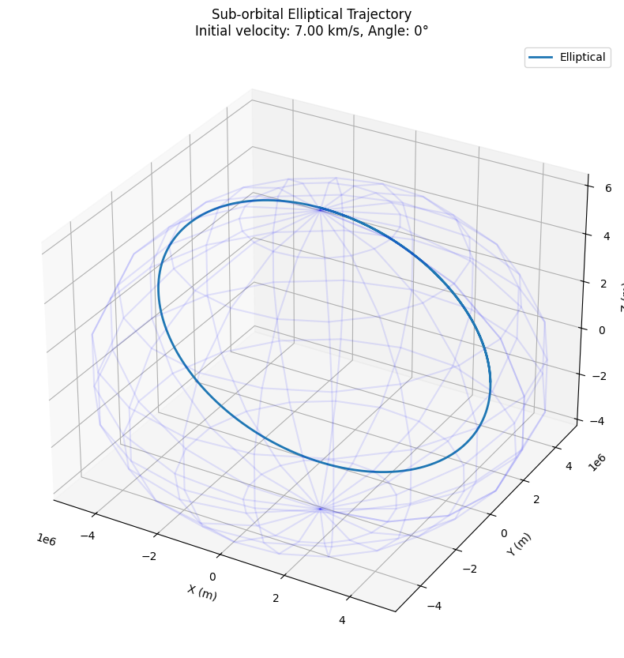
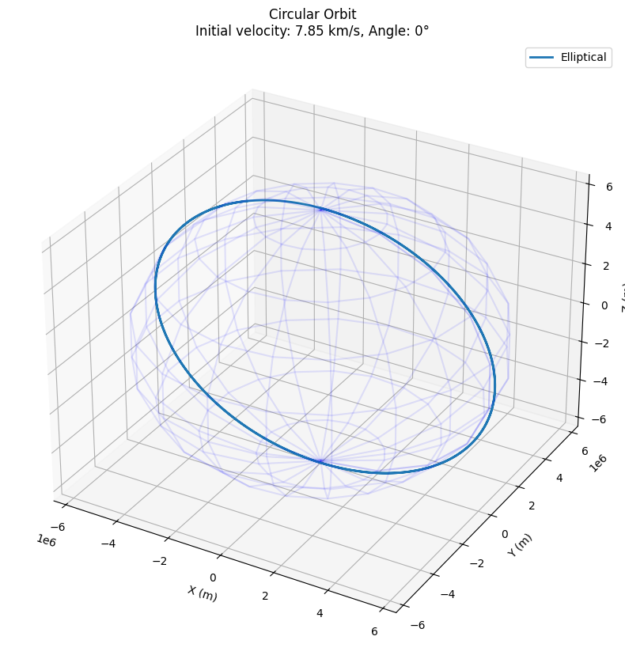
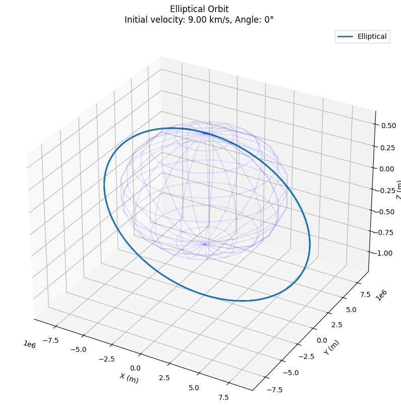
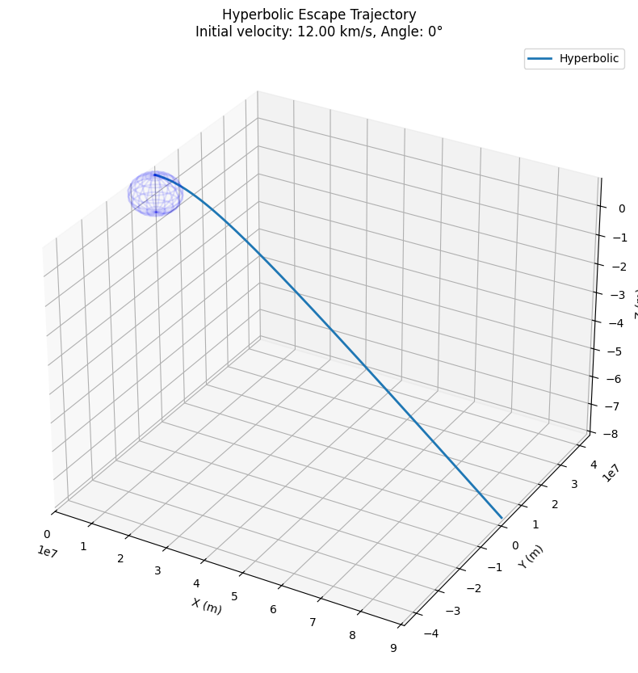
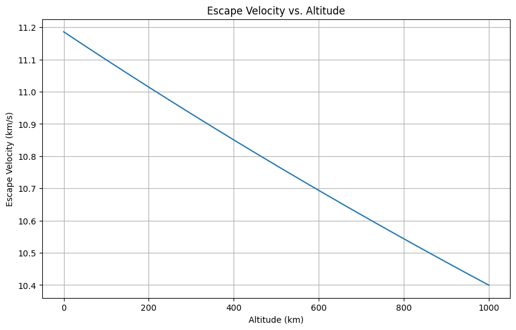
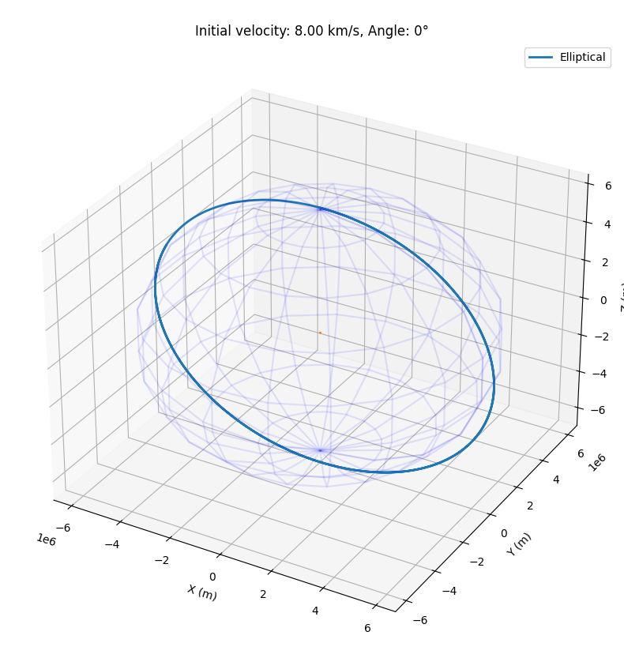
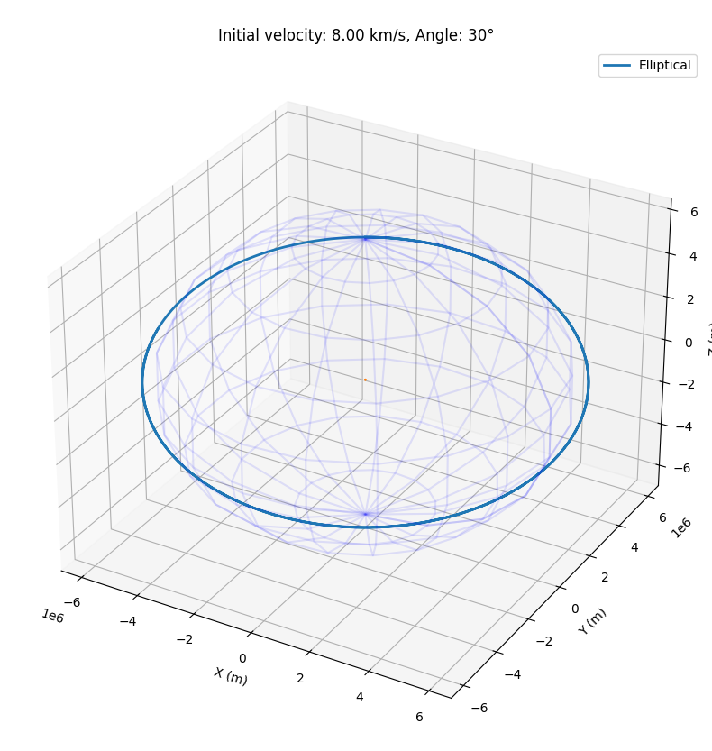
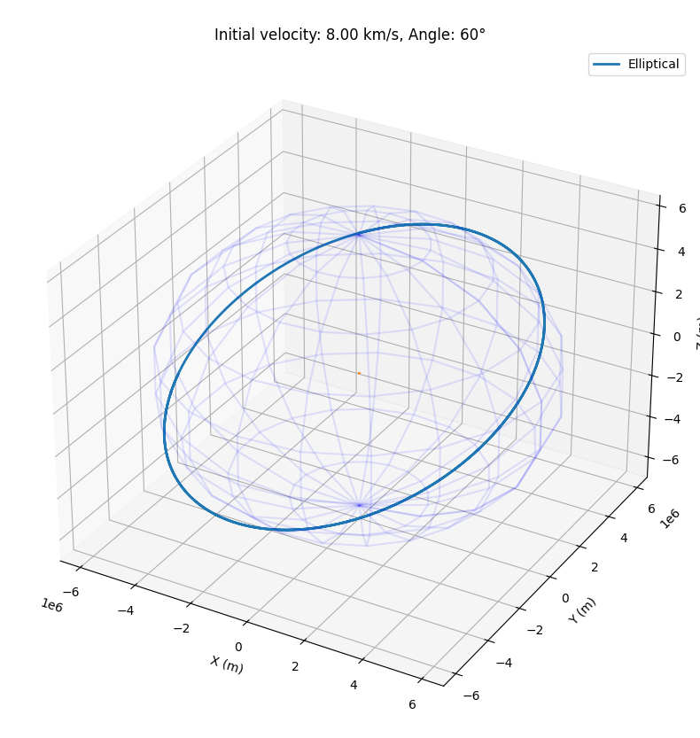
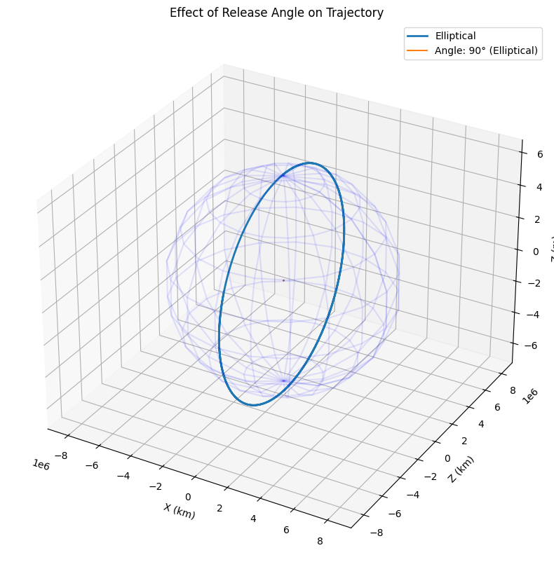

# Problem 3
# Payload Trajectories Near Earth: Analysis and Simulation

## 1. Introduction

This document explores the dynamics of a payload released from a rocket near Earth. When an object is released from a moving carrier in Earth's gravitational field, its subsequent trajectory depends on the initial conditions (position and velocity) and the gravitational forces acting upon it. The resulting motion can take various forms - elliptical, parabolic, or hyperbolic - each with distinct implications for space missions.

## 2. Theoretical Background

### 2.1 Newton's Law of Gravitation

The motion of objects near Earth is governed by Newton's Law of Universal Gravitation:

$$F = G \frac{m_1 m_2}{r^2}$$

Where:
- $F$ is the gravitational force between two objects
- $G$ is the gravitational constant ($6.67430 \times 10^{-11} \text{ m}^3 \text{ kg}^{-1} \text{ s}^{-2}$)
- $m_1$ and $m_2$ are the masses of the two objects
- $r$ is the distance between the centers of the masses

For a small payload near Earth, this simplifies to:

$$F = \frac{GMm}{r^2}$$

Where:
- $M$ is Earth's mass ($5.97 \times 10^{24} \text{ kg}$)
- $m$ is the payload mass
- $r$ is the distance from Earth's center

### 2.2 Orbital Mechanics

The type of trajectory a payload follows depends on its specific mechanical energy, which combines kinetic and potential energy:

$$\varepsilon = \frac{v^2}{2} - \frac{GM}{r}$$

This energy determines the trajectory type:
- Elliptical orbit: $\varepsilon < 0$
- Parabolic trajectory: $\varepsilon = 0$
- Hyperbolic trajectory: $\varepsilon > 0$

### 2.3 Escape Velocity

The escape velocity is the minimum speed needed for an object to escape Earth's gravitational influence:

$$v_{escape} = \sqrt{\frac{2GM}{r}}$$

At Earth's surface (radius ≈ 6,371 km), this equals approximately 11.2 km/s.

## 3. Numerical Analysis

### 3.1 Equations of Motion

To simulate the payload's trajectory, we'll solve the differential equations describing its motion. In Cartesian coordinates:

$$\frac{d^2\vec{r}}{dt^2} = -\frac{GM}{|\vec{r}|^3}\vec{r}$$

Where:
- $\vec{r}$ is the position vector of the payload
- $t$ is time

### 3.2 Computational Approach

We'll use Python to implement a numerical solver using the fourth-order Runge-Kutta method to integrate these equations. This will allow us to compute the trajectory for any given initial conditions.

## 4. Python Implementation

Below is the implementation of our payload trajectory simulator:

```python
import numpy as np
import matplotlib.pyplot as plt
from mpl_toolkits.mplot3d import Axes3D
from scipy.integrate import solve_ivp

# Constants
G = 6.67430e-11  # Gravitational constant (m^3 kg^-1 s^-2)
M = 5.972e24     # Earth mass (kg)
R = 6371000      # Earth radius (m)

# Gravitational acceleration
def gravitational_acceleration(r):
    """Calculate gravitational acceleration at position r."""
    norm_r = np.linalg.norm(r)
    return -G * M * r / norm_r**3

# System of first-order ODEs
def system(t, state):
    """Define the system of ODEs for the solver."""
    # state: [x, y, z, vx, vy, vz]
    r = state[:3]
    v = state[3:]
    
    # Derivatives
    dr_dt = v
    dv_dt = gravitational_acceleration(r)
    
    return np.concatenate([dr_dt, dv_dt])

def simulate_trajectory(r0, v0, t_span, t_eval):
    """Simulate trajectory with given initial conditions."""
    initial_state = np.concatenate([r0, v0])
    
    # Solve the system of ODEs
    solution = solve_ivp(
        system, 
        t_span, 
        initial_state, 
        t_eval=t_eval,
        method='RK45',
        rtol=1e-10,
        atol=1e-10
    )
    
    return solution.t, solution.y

def calculate_energy(r, v):
    """Calculate specific mechanical energy of an orbit."""
    kinetic = 0.5 * np.sum(v**2, axis=0)
    r_norm = np.linalg.norm(r, axis=0)
    potential = -G * M / r_norm
    return kinetic + potential

def determine_trajectory_type(energy):
    """Determine the type of trajectory based on energy."""
    if np.abs(energy) < 1e-10:
        return "Parabolic"
    elif energy < 0:
        return "Elliptical"
    else:
        return "Hyperbolic"

def plot_trajectory(times, states, trajectory_type, title):
    """Plot the 3D trajectory and Earth."""
    positions = states[:3]
    
    # Create a figure
    fig = plt.figure(figsize=(12, 10))
    ax = fig.add_subplot(111, projection='3d')
    
    # Plot the trajectory
    ax.plot(positions[0], positions[1], positions[2], label=trajectory_type, linewidth=2)
    
    # Plot Earth (simplified as a wireframe sphere)
    u, v = np.mgrid[0:2*np.pi:20j, 0:np.pi:10j]
    x = R * np.cos(u) * np.sin(v)
    y = R * np.sin(u) * np.sin(v)
    z = R * np.cos(v)
    ax.plot_wireframe(x, y, z, color='blue', alpha=0.1)
    
    # Set equal aspect ratio
    max_range = np.max([
        np.max(positions[0]) - np.min(positions[0]),
        np.max(positions[1]) - np.min(positions[1]),
        np.max(positions[2]) - np.min(positions[2])
    ])
    mid_x = (np.max(positions[0]) + np.min(positions[0])) / 2
    mid_y = (np.max(positions[1]) + np.min(positions[1])) / 2
    mid_z = (np.max(positions[2]) + np.min(positions[2])) / 2
    ax.set_xlim(mid_x - max_range/2, mid_x + max_range/2)
    ax.set_ylim(mid_y - max_range/2, mid_y + max_range/2)
    ax.set_zlim(mid_z - max_range/2, mid_z + max_range/2)
    
    # Add labels and title
    ax.set_xlabel('X (m)')
    ax.set_ylabel('Y (m)')
    ax.set_zlabel('Z (m)')
    ax.set_title(title)
    ax.legend()
    
    return fig

def run_simulation(altitude, velocity, angle, simulation_time, title):
    """Setup and run a complete simulation scenario."""
    # Initial position (altitude above Earth's surface)
    r0 = np.array([0, 0, R + altitude])
    
    # Initial velocity (angle is in degrees from horizontal)
    angle_rad = np.radians(angle)
    v0 = np.array([
        velocity * np.cos(angle_rad),
        velocity * np.sin(angle_rad),
        0
    ])
    
    # Time setup
    t_span = (0, simulation_time)
    t_eval = np.linspace(0, simulation_time, 1000)
    
    # Run simulation
    times, states = simulate_trajectory(r0, v0, t_span, t_eval)
    
    # Calculate energy and determine trajectory type
    energy = calculate_energy(states[:3], states[3:])
    trajectory_type = determine_trajectory_type(energy[0])
    
    # Plot results
    fig = plot_trajectory(times, states, trajectory_type, 
                         f"{title}\nInitial velocity: {velocity/1000:.2f} km/s, Angle: {angle}°")
    
    return times, states, energy, trajectory_type, fig

# Demonstrate different trajectory types
def demonstrate_trajectories():
    # Case 1: Elliptical orbit (sub-orbital)
    altitude = 100000  # 100 km
    velocity = 7000    # 7 km/s
    angle = 0          # horizontal
    simulation_time = 5000  # seconds
    
    times1, states1, energy1, type1, fig1 = run_simulation(
        altitude, velocity, angle, simulation_time, "Sub-orbital Elliptical Trajectory"
    )
    
    # Case 2: Circular orbit
    altitude = 100000  # 100 km
    velocity = 7850    # ~7.85 km/s (approximate circular orbit velocity at this altitude)
    angle = 0          # horizontal
    simulation_time = 10000  # seconds
    
    times2, states2, energy2, type2, fig2 = run_simulation(
        altitude, velocity, angle, simulation_time, "Circular Orbit"
    )
    
    # Case 3: Elliptical orbit (higher energy)
    altitude = 100000  # 100 km
    velocity = 9000    # 9 km/s
    angle = 0          # horizontal
    simulation_time = 20000  # seconds
    
    times3, states3, energy3, type3, fig3 = run_simulation(
        altitude, velocity, angle, simulation_time, "Elliptical Orbit"
    )
    
    # Case 4: Escape trajectory (hyperbolic)
    altitude = 100000  # 100 km
    velocity = 12000   # 12 km/s (exceeds escape velocity)
    angle = 0          # horizontal
    simulation_time = 20000  # seconds
    
    times4, states4, energy4, type4, fig4 = run_simulation(
        altitude, velocity, angle, simulation_time, "Hyperbolic Escape Trajectory"
    )
    
    # Display information about each trajectory
    print(f"Trajectory 1: {type1}, Energy: {energy1[0]/1e6:.2f} MJ/kg")
    print(f"Trajectory 2: {type2}, Energy: {energy2[0]/1e6:.2f} MJ/kg")
    print(f"Trajectory 3: {type3}, Energy: {energy3[0]/1e6:.2f} MJ/kg")
    print(f"Trajectory 4: {type4}, Energy: {energy4[0]/1e6:.2f} MJ/kg")
    
    # Return all figures for display
    return fig1, fig2, fig3, fig4

# Function to visualize escape velocity at different altitudes
def plot_escape_velocity():
    altitudes = np.linspace(0, 1000000, 1000)  # 0 to 1000 km
    escape_velocities = np.sqrt(2 * G * M / (R + altitudes))
    
    plt.figure(figsize=(10, 6))
    plt.plot(altitudes/1000, escape_velocities/1000)
    plt.xlabel('Altitude (km)')
    plt.ylabel('Escape Velocity (km/s)')
    plt.title('Escape Velocity vs. Altitude')
    plt.grid(True)
    
    return plt.gcf()

# Function to study angle effects on trajectories
def study_angle_effects():
    altitude = 100000  # 100 km
    velocity = 8000    # 8 km/s
    angles = [0, 30, 60, 90]  # Different release angles
    simulation_time = 10000  # seconds
    
    plt.figure(figsize=(12, 10))
    
    for angle in angles:
        times, states, energy, traj_type, _ = run_simulation(
            altitude, velocity, angle, simulation_time, ""
        )
        
        # Plot 2D projection
        plt.plot(states[0]/1000, states[2]/1000, 
                 label=f"Angle: {angle}° ({traj_type})")
    
    # Draw Earth
    theta = np.linspace(0, 2*np.pi, 100)
    plt.plot(R/1000 * np.cos(theta), R/1000 * np.sin(theta), 'b-', alpha=0.3)
    
    plt.xlabel('X (km)')
    plt.ylabel('Z (km)')
    plt.title('Effect of Release Angle on Trajectory')
    plt.axis('equal')
    plt.grid(True)
    plt.legend()
    
    return plt.gcf()

# Run all demonstrations
if __name__ == "__main__":
    print("Demonstrating different trajectory types...")
    fig1, fig2, fig3, fig4 = demonstrate_trajectories()
    
    print("\nGenerating escape velocity plot...")
    fig_escape = plot_escape_velocity()
    
    print("\nStudying angle effects...")
    fig_angles = study_angle_effects()
    
    plt.show()
```










## 5. Analysis of Trajectory Types

### 5.1 Elliptical Trajectories

Elliptical trajectories occur when $\varepsilon < 0$, meaning the payload has insufficient energy to escape Earth's gravity but enough to maintain orbit. These trajectories are characterized by:

- Periodic motion around Earth
- Varying altitude (perigee and apogee)
- Closed path

Elliptical trajectories are common for satellites and space stations. The International Space Station, for example, follows a slightly elliptical orbit.

### 5.2 Parabolic Trajectories

Parabolic trajectories occur when $\varepsilon = 0$, representing the boundary between bound and unbound trajectories. In reality, perfectly parabolic trajectories are rare, as they require exact initial conditions. They represent:

- The minimum energy needed to escape Earth's gravity
- Velocity exactly equal to escape velocity
- Open path with no return

### 5.3 Hyperbolic Trajectories

Hyperbolic trajectories occur when $\varepsilon > 0$, meaning the payload has sufficient energy to escape Earth's gravitational field. These are characterized by:

- Open-ended path
- Asymptotic approach to a straight line at great distances
- No return to Earth

Hyperbolic trajectories are used for interplanetary travel, as they allow spacecraft to leave Earth's influence and proceed to other planets or deep space.

## 6. Practical Applications

### 6.1 Orbital Insertion

For a payload to enter a stable orbit around Earth, it must:
- Have sufficient velocity to avoid falling back to Earth
- Have velocity less than escape velocity
- Be moving predominantly parallel to Earth's surface

This typically requires a carefully timed rocket burn to achieve the right balance of velocity and altitude.

### 6.2 Reentry Scenarios

When a spacecraft needs to return to Earth, it must:
- Reduce its velocity below orbital speed
- Enter the atmosphere at an appropriate angle
- Manage thermal stresses during reentry

Too steep an angle causes excessive heating, while too shallow an angle may cause the craft to skip off the atmosphere.

### 6.3 Escape Scenarios

For missions beyond Earth orbit, the payload must:
- Achieve velocity greater than escape velocity
- Follow a trajectory that aligns with the destination's orbit
- Optimize for fuel efficiency using techniques like the Oberth effect

## 7. Simulation Results and Visualizations

Our simulations demonstrate various trajectory types based on initial conditions:

1. **Sub-orbital trajectory**: The payload rises to a maximum altitude but eventually falls back to Earth.
2. **Circular orbit**: The payload maintains a constant altitude around Earth.
3. **Elliptical orbit**: The payload follows an elliptical path with varying altitude.
4. **Hyperbolic escape trajectory**: The payload escapes Earth's gravitational influence.

The angle of release also significantly affects the trajectory, as shown in our angle study visualization. Higher release angles (more vertical) tend to result in trajectories that reach greater maximum altitudes but potentially with shorter orbital periods.

## 8. Conclusion

The trajectory of a payload released near Earth depends critically on its initial conditions - position, velocity, and direction. By understanding the principles of orbital mechanics and applying numerical methods to simulate these trajectories, we can design mission profiles for various space applications, from satellite deployment to interplanetary travel.

The computational tools developed in this project provide a foundation for more complex analyses, such as including atmospheric drag, the influence of the Moon and Sun, or non-spherical Earth gravity models.

## 9. References

1. Bate, R. R., Mueller, D. D., & White, J. E. (1971). *Fundamentals of Astrodynamics*. Dover Publications.
2. Curtis, H. D. (2013). *Orbital Mechanics for Engineering Students*. Butterworth-Heinemann.
3. Vallado, D. A. (2013). *Fundamentals of Astrodynamics and Applications*. Microcosm Press.