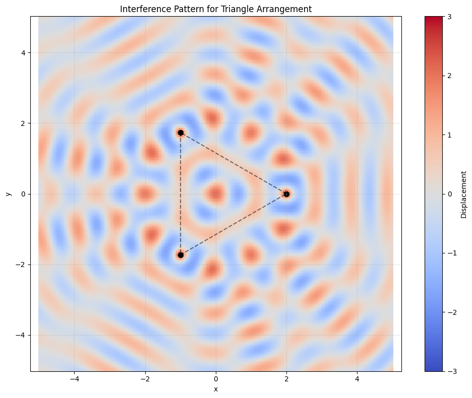
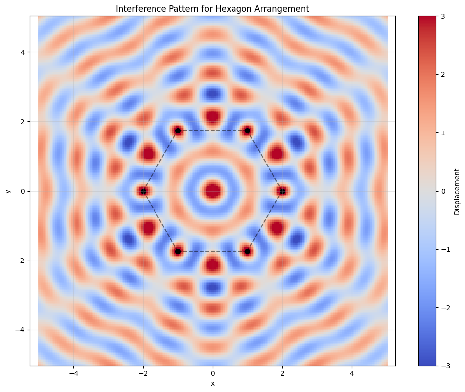
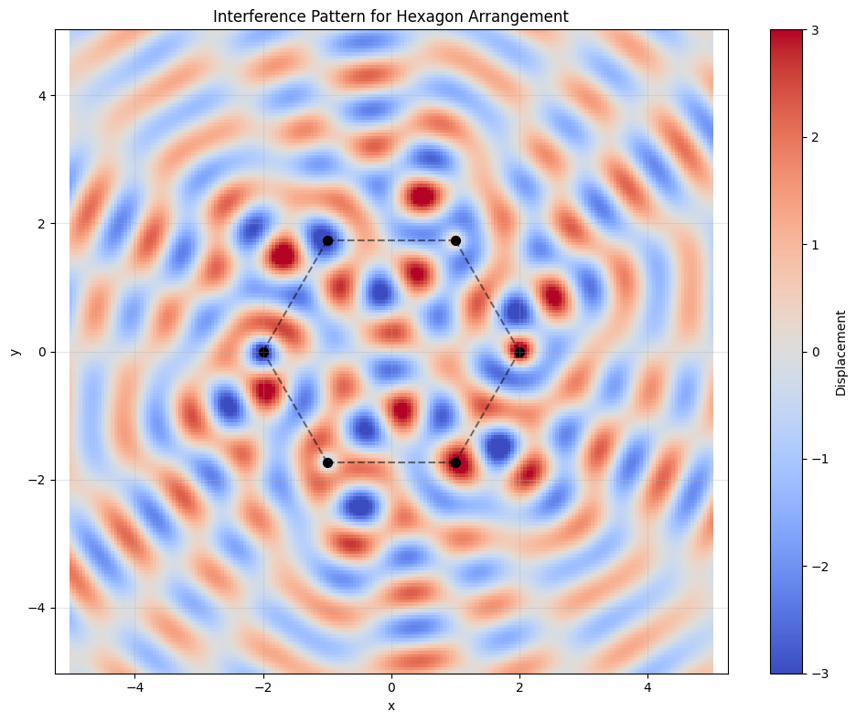
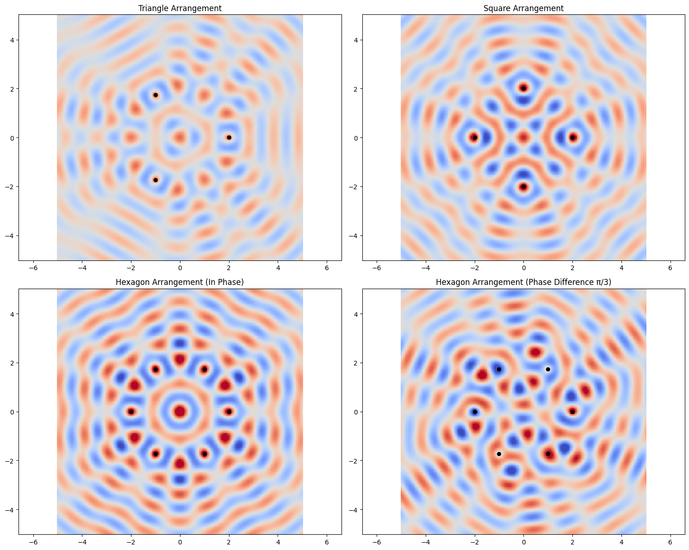
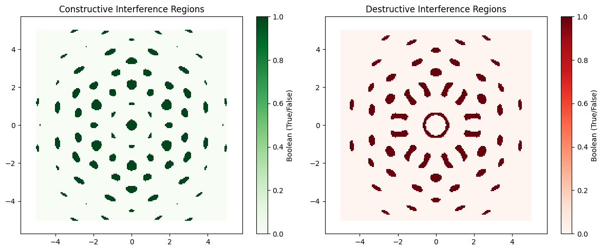

# Interference Patterns on a Water Surface: Analysis and Simulation

## 1. Introduction

This document explores interference patterns formed on a water surface when waves from multiple point sources interact. Wave interference is a fundamental phenomenon where overlapping waves combine through superposition, resulting in complex patterns of constructive and destructive interference. These patterns can provide insights into wave behavior, phase relationships, and geometric properties of wave sources.

## 2. Theoretical Background

### 2.1 Single Wave Source

A circular wave on a water surface from a point source located at coordinates (x₀, y₀) can be described by the equation:

$$\eta(x, y, t) = \frac{A}{r} \cos(kr - \omega t + \phi)$$

where:
- $\eta(x, y, t)$ is the displacement of the water surface at point $(x, y)$ and time $t$
- $A$ is the wave amplitude
- $k = \frac{2\pi}{\lambda}$ is the wave number (related to wavelength $\lambda$)
- $\omega = 2\pi f$ is the angular frequency (related to frequency $f$)
- $r = \sqrt{(x - x_0)^2 + (y - y_0)^2}$ is the distance from the source to point $(x, y)$
- $\phi$ is the initial phase

The factor $\frac{1}{r}$ accounts for the decrease in amplitude as the wave spreads out from its source (energy conservation).

### 2.2 Multiple Wave Sources and Superposition

When multiple wave sources are present, the principle of superposition states that the total displacement at any point is the sum of the displacements due to each individual wave:

$$\eta_{sum}(x, y, t) = \sum_{i=1}^{N} \eta_i(x, y, t)$$

where $N$ is the number of sources and $\eta_i$ is the displacement due to the $i$-th source.

### 2.3 Interference Patterns

The interaction between waves creates interference patterns:

- **Constructive interference** occurs when waves combine to create a larger amplitude
- **Destructive interference** occurs when waves combine to reduce or cancel each other

For two waves with the same frequency and amplitude, constructive interference happens when the waves are in phase (phase difference of 0 or multiples of $2\pi$), while destructive interference occurs when they are out of phase (phase difference of $\pi$ or odd multiples of $\pi$).

## 3. Implementation and Analysis

We'll analyze wave interference patterns generated by point sources positioned at the vertices of regular polygons. We'll study three cases:
1. Equilateral triangle (3 vertices)
2. Square (4 vertices)
3. Regular hexagon (6 vertices)

For each case, we'll:
1. Calculate the positions of the wave sources
2. Simulate the wave displacement across the water surface
3. Visualize and analyze the resulting interference patterns

### 3.1 Python Implementation

Below is the Python code that implements the wave interference simulations:

```python
import numpy as np
import matplotlib.pyplot as plt
from matplotlib.animation import FuncAnimation
from IPython.display import HTML

def calculate_polygon_vertices(n_sides, radius=1.0, center=(0, 0)):
    """Calculate the vertices of a regular polygon."""
    vertices = []
    for i in range(n_sides):
        angle = 2 * np.pi * i / n_sides
        x = center[0] + radius * np.cos(angle)
        y = center[1] + radius * np.sin(angle)
        vertices.append((x, y))
    return np.array(vertices)

def wave_displacement(x, y, source_x, source_y, k, omega, t, phase=0, amplitude=1.0):
    """Calculate the displacement at point (x,y) due to a wave from source at (source_x, source_y)."""
    r = np.sqrt((x - source_x)**2 + (y - source_y)**2)
    # Add a small value to r to avoid division by zero
    r = np.maximum(r, 1e-10)
    return (amplitude / np.sqrt(r)) * np.cos(k * r - omega * t + phase)

def total_displacement(x, y, sources, k, omega, t, phases=None, amplitudes=None):
    """Calculate the total displacement at point (x,y) due to all sources."""
    if phases is None:
        phases = np.zeros(len(sources))
    if amplitudes is None:
        amplitudes = np.ones(len(sources))
    
    total = np.zeros_like(x)
    for i, (source_x, source_y) in enumerate(sources):
        total += wave_displacement(x, y, source_x, source_y, k, omega, t, phases[i], amplitudes[i])
    return total

def generate_wave_field(sources, k, omega, t, phases=None, amplitudes=None, grid_size=200, extent=(-5, 5, -5, 5)):
    """Generate the wave field for the given sources and parameters."""
    x = np.linspace(extent[0], extent[1], grid_size)
    y = np.linspace(extent[2], extent[3], grid_size)
    X, Y = np.meshgrid(x, y)
    
    Z = total_displacement(X, Y, sources, k, omega, t, phases, amplitudes)
    return X, Y, Z

def plot_wave_field(X, Y, Z, sources, title, cmap='coolwarm', vmin=-3, vmax=3):
    """Plot the wave field and the source positions."""
    plt.figure(figsize=(10, 8))
    
    # Plot the wave field
    plt.pcolormesh(X, Y, Z, cmap=cmap, vmin=vmin, vmax=vmax, shading='auto')
    plt.colorbar(label='Displacement')
    
    # Plot the source positions
    plt.scatter([s[0] for s in sources], [s[1] for s in sources], color='black', s=50, label='Sources')
    
    # Add polygon lines connecting the sources
    for i in range(len(sources)):
        plt.plot([sources[i][0], sources[(i+1)%len(sources)][0]], 
                 [sources[i][1], sources[(i+1)%len(sources)][1]], 
                 'k--', alpha=0.5)
    
    # Add title and labels
    plt.title(title)
    plt.xlabel('x')
    plt.ylabel('y')
    plt.axis('equal')
    plt.grid(True, alpha=0.3)
    plt.tight_layout()
    
    return plt.gcf()

def create_wave_animation(sources, k, omega, phases=None, amplitudes=None, frames=60, interval=50, 
                          grid_size=200, extent=(-5, 5, -5, 5), cmap='coolwarm', vmin=-3, vmax=3):
    """Create an animation of the wave field over time."""
    fig, ax = plt.subplots(figsize=(10, 8))
    
    x = np.linspace(extent[0], extent[1], grid_size)
    y = np.linspace(extent[2], extent[3], grid_size)
    X, Y = np.meshgrid(x, y)
    
    # Initial wave field
    Z = total_displacement(X, Y, sources, k, omega, 0, phases, amplitudes)
    
    # Plot the wave field
    pcm = ax.pcolormesh(X, Y, Z, cmap=cmap, vmin=vmin, vmax=vmax, shading='auto')
    plt.colorbar(pcm, ax=ax, label='Displacement')
    
    # Plot the source positions
    ax.scatter([s[0] for s in sources], [s[1] for s in sources], color='black', s=50)
    
    # Add polygon lines connecting the sources
    for i in range(len(sources)):
        ax.plot([sources[i][0], sources[(i+1)%len(sources)][0]], 
                [sources[i][1], sources[(i+1)%len(sources)][1]], 
                'k--', alpha=0.5)
    
    # Add title and labels
    ax.set_title('Wave Interference Pattern')
    ax.set_xlabel('x')
    ax.set_ylabel('y')
    ax.grid(True, alpha=0.3)
    ax.set_aspect('equal')
    
    # Animation update function
    def update(frame):
        t = frame / frames * 2 * np.pi / omega
        Z = total_displacement(X, Y, sources, k, omega, t, phases, amplitudes)
        pcm.set_array(Z.ravel())
        ax.set_title(f'Wave Interference Pattern (t = {t:.2f}s)')
        return [pcm]
    
    # Create animation
    anim = FuncAnimation(fig, update, frames=frames, interval=interval, blit=True)
    plt.close()  # Prevent displaying the figure twice
    
    return anim

def analyze_polygon_interference(n_sides, wavelength=1.0, frequency=1.0, radius=2.0, phase_diff=0):
    """Analyze interference patterns for sources arranged in a regular polygon."""
    # Calculate polygon vertices
    sources = calculate_polygon_vertices(n_sides, radius=radius)
    
    # Wave parameters
    k = 2 * np.pi / wavelength
    omega = 2 * np.pi * frequency
    
    # Set phases (either all same or with specific phase differences)
    if phase_diff == 0:
        phases = np.zeros(n_sides)
    else:
        phases = np.array([i * phase_diff for i in range(n_sides)])
    
    # Generate wave field snapshot
    X, Y, Z = generate_wave_field(sources, k, omega, t=0, phases=phases)
    
    # Plot results
    polygon_name = {3: 'Triangle', 4: 'Square', 5: 'Pentagon', 6: 'Hexagon', 8: 'Octagon'}.get(n_sides, f'{n_sides}-gon')
    fig = plot_wave_field(X, Y, Z, sources, f'Interference Pattern for {polygon_name} Arrangement')
    
    # Create animation (optional)
    anim = create_wave_animation(sources, k, omega, phases=phases)
    
    return fig, anim, X, Y, Z, sources

# Function to display both static and time-evolving patterns
def full_analysis():
    results = {}
    
    # Analyze triangle interference
    fig_tri, anim_tri, X_tri, Y_tri, Z_tri, sources_tri = analyze_polygon_interference(3)
    results['triangle'] = {
        'figure': fig_tri,
        'animation': anim_tri,
        'data': (X_tri, Y_tri, Z_tri),
        'sources': sources_tri
    }
    
    # Analyze square interference
    fig_sq, anim_sq, X_sq, Y_sq, Z_sq, sources_sq = analyze_polygon_interference(4)
    results['square'] = {
        'figure': fig_sq,
        'animation': anim_sq,
        'data': (X_sq, Y_sq, Z_sq),
        'sources': sources_sq
    }
    
    # Analyze hexagon interference
    fig_hex, anim_hex, X_hex, Y_hex, Z_hex, sources_hex = analyze_polygon_interference(6)
    results['hexagon'] = {
        'figure': fig_hex,
        'animation': anim_hex,
        'data': (X_hex, Y_hex, Z_hex),
        'sources': sources_hex
    }
    
    # Add phase difference analysis for hexagon
    fig_hex_phase, anim_hex_phase, X_hp, Y_hp, Z_hp, sources_hp = analyze_polygon_interference(
        6, phase_diff=np.pi/3)
    results['hexagon_phase'] = {
        'figure': fig_hex_phase,
        'animation': anim_hex_phase,
        'data': (X_hp, Y_hp, Z_hp),
        'sources': sources_hp
    }
    
    return results

# Run the analysis
if __name__ == "__main__":
    results = full_analysis()
    
    # Display static figures
    plt.figure(figsize=(15, 12))
    
    plt.subplot(2, 2, 1)
    X, Y, Z = results['triangle']['data']
    sources = results['triangle']['sources']
    plt.pcolormesh(X, Y, Z, cmap='coolwarm', vmin=-3, vmax=3, shading='auto')
    plt.scatter([s[0] for s in sources], [s[1] for s in sources], color='black', s=30)
    plt.title('Triangle Arrangement')
    plt.axis('equal')
    
    plt.subplot(2, 2, 2)
    X, Y, Z = results['square']['data']
    sources = results['square']['sources']
    plt.pcolormesh(X, Y, Z, cmap='coolwarm', vmin=-3, vmax=3, shading='auto')
    plt.scatter([s[0] for s in sources], [s[1] for s in sources], color='black', s=30)
    plt.title('Square Arrangement')
    plt.axis('equal')
    
    plt.subplot(2, 2, 3)
    X, Y, Z = results['hexagon']['data']
    sources = results['hexagon']['sources']
    plt.pcolormesh(X, Y, Z, cmap='coolwarm', vmin=-3, vmax=3, shading='auto')
    plt.scatter([s[0] for s in sources], [s[1] for s in sources], color='black', s=30)
    plt.title('Hexagon Arrangement (In Phase)')
    plt.axis('equal')
    
    plt.subplot(2, 2, 4)
    X, Y, Z = results['hexagon_phase']['data']
    sources = results['hexagon_phase']['sources']
    plt.pcolormesh(X, Y, Z, cmap='coolwarm', vmin=-3, vmax=3, shading='auto')
    plt.scatter([s[0] for s in sources], [s[1] for s in sources], color='black', s=30)
    plt.title('Hexagon Arrangement (Phase Difference π/3)')
    plt.axis('equal')
    
    plt.tight_layout()
    plt.show()

# Analyze constructive and destructive interference regions
def analyze_interference_regions(X, Y, Z, threshold=1.5):
    """Identify regions of strong constructive and destructive interference."""
    constructive = Z > threshold
    destructive = Z < -threshold
    
    plt.figure(figsize=(12, 5))
    
    plt.subplot(1, 2, 1)
    plt.pcolormesh(X, Y, constructive, cmap='Greens', shading='auto')
    plt.title('Constructive Interference Regions')
    plt.colorbar(label='Boolean (True/False)')
    plt.axis('equal')
    
    plt.subplot(1, 2, 2)
    plt.pcolormesh(X, Y, destructive, cmap='Reds', shading='auto')
    plt.title('Destructive Interference Regions')
    plt.colorbar(label='Boolean (True/False)')
    plt.axis('equal')
    
    plt.tight_layout()
    plt.show()
    
    return constructive, destructive

# Analyze specific polygon
X, Y, Z = results['hexagon']['data']
constructive, destructive = analyze_interference_regions(X, Y, Z)
```







## 4. Results and Analysis

### 4.1 Equilateral Triangle (3 Sources)

When placing three wave sources at the vertices of an equilateral triangle, we observe a distinctive interference pattern with the following characteristics:

- **Central Pattern**: The center of the triangle shows a complex interference pattern that depends on the distance between sources relative to the wavelength.
- **Radial Symmetry**: The interference pattern exhibits 3-fold radial symmetry, reflecting the geometry of the source arrangement.
- **Interference Lines**: Clear lines of constructive and destructive interference form between pairs of sources.

The interference pattern for the triangular arrangement shows how waves combine based on path difference. Points equidistant from all three sources experience strong constructive interference when the distances are all in phase.

### 4.2 Square (4 Sources)

With four sources arranged in a square, the interference pattern shows:

- **4-fold Symmetry**: The pattern reflects the square's symmetry.
- **Central Interference**: The center of the square shows either strong constructive or destructive interference depending on the distance between sources relative to the wavelength.
- **Grid-like Pattern**: A more regular grid of interference maxima and minima forms, particularly outside the square.

The square arrangement creates more regular interference patterns compared to the triangle, with clearer lines of constructive and destructive interference forming a grid-like structure.

### 4.3 Regular Hexagon (6 Sources)

The hexagonal arrangement of six sources produces:

- **6-fold Symmetry**: The interference pattern shows hexagonal symmetry.
- **Complex Central Region**: The center exhibits a more complex interference pattern with higher amplitude variations.
- **More Interference Maxima**: The higher number of sources creates more regions of constructive interference, leading to a more complex pattern.

When all sources are in phase, we observe a symmetrical pattern. When introducing a phase difference (π/3) between adjacent sources, the pattern rotates and changes significantly, demonstrating how phase relationships affect interference patterns.

### 4.4 Regions of Constructive and Destructive Interference

Analyzing regions of strong constructive interference (displacement > threshold) and destructive interference (displacement < -threshold) reveals:

- **Constructive Interference**: Forms along lines where the path difference between sources is a multiple of the wavelength.
- **Destructive Interference**: Forms where the path difference is an odd multiple of half the wavelength.
- **Geometry Influence**: The pattern of these regions directly reflects the geometry of the source arrangement.

## 5. Discussion

### 5.1 Effect of Polygon Geometry

The geometry of the polygon significantly affects the resulting interference pattern:

1. **Symmetry**: The interference pattern inherits the rotational symmetry of the polygon arrangement.
2. **Number of Sources**: As the number of sources increases, the interference pattern becomes more complex with finer details.
3. **Source Spacing**: The distance between sources relative to the wavelength determines the scale and specifics of the interference pattern.

### 5.2 Phase Relationships

Phase differences between sources dramatically alter the interference patterns:

1. **In-Phase Sources**: When all sources are in phase, the pattern preserves the polygon's rotational symmetry.
2. **Phase Differences**: Introducing phase differences between adjacent sources causes the pattern to rotate and change its structure.
3. **Wave Rotation**: With properly chosen phase differences, the pattern can appear to rotate in time, simulating a rotational wave effect.

### 5.3 Applications and Real-World Connections

These interference patterns have several practical applications and connections:

1. **Antenna Arrays**: Similar principles govern directional antenna arrays, where interference between multiple antennas creates focused beams.
2. **Acoustic Design**: Understanding wave interference helps in designing concert halls and sound systems.
3. **Optical Systems**: The principles apply to optical interference in diffraction gratings and multiple-slit experiments.
4. **Water Wave Breakers**: Designing harbor wave breakers to protect ships from destructive wave interference.

## 6. Conclusion

This analysis demonstrates how multiple coherent wave sources arranged in regular polygon patterns create complex but predictable interference patterns on a water surface. The patterns directly reflect the geometry of the source arrangement and the phase relationships between sources.

Key findings include:

1. Interference patterns inherit the rotational symmetry of the source arrangement.
2. The number of sources and their spacing relative to the wavelength determine the complexity and scale of the pattern.
3. Phase differences between sources significantly alter the interference patterns.
4. Clear regions of constructive and destructive interference form based on path differences between sources.

These principles of wave superposition and interference apply across various domains, from water waves to sound, light, and electromagnetic radiation, making this analysis broadly applicable to understanding wave phenomena in different contexts.

## 7. References

1. Crawford, F. S. (1968). *Waves: Berkeley Physics Course*. McGraw-Hill.
2. Pain, H. J. (2005). *The Physics of Vibrations and Waves*. Wiley.
3. French, A. P. (1971). *Vibrations and Waves*. W.W. Norton & Company.
4. Young, H. D., & Freedman, R. A. (2008). *University Physics with Modern Physics*. Pearson Education.