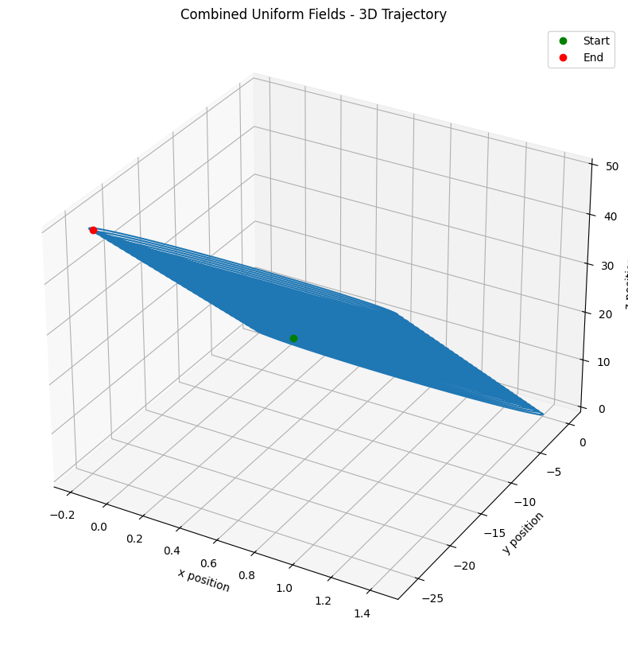

# Problem 1: Lorentz Force Simulation

## 1. Exploration of Applications

### Systems where the Lorentz force plays a key role

The Lorentz force, expressed as F = qE + qv × B, governs the motion of charged particles in electric and magnetic fields and is fundamental in numerous scientific and technological applications:

**Particle Accelerators**: Linear accelerators and cyclotrons use precisely controlled electromagnetic fields to accelerate charged particles to high energies for research and medical applications.

**Mass Spectrometers**: These devices separate ions based on their mass-to-charge ratio using magnetic fields that curve particle trajectories differently depending on their properties.

**Plasma Confinement**: Tokamaks and stellarators use magnetic fields to confine hot plasma for fusion research, preventing the charged particles from contacting and cooling against reactor walls.

**Magnetohydrodynamic (MHD) Generators**: These convert thermal and kinetic energy directly into electricity using the movement of conductive plasma through a magnetic field.

**Hall Thrusters**: Used in spacecraft propulsion, these accelerate ions using electric fields while magnetic fields trap electrons that help maintain the electric field.

**Electron Microscopes**: Both transmission and scanning electron microscopes use magnetic fields to focus beams of electrons.

### Relevance of electric (E) and magnetic (B) fields

Electric and magnetic fields control charged particle motion in complementary ways:

**Electric Fields (E)**:
- Cause acceleration parallel to field lines
- Force magnitude depends on charge (q) but not velocity
- Energy-changing (can increase or decrease particle energy)
- Used primarily to accelerate particles along straight paths
- Critical for increasing particle energy in accelerators

**Magnetic Fields (B)**:
- Cause acceleration perpendicular to both the field and particle velocity
- Force magnitude depends on both charge (q) and velocity (v)
- Energy-conserving (changes direction but not speed in uniform fields)
- Creates circular, helical, or drift motions
- Used for steering, focusing, and confining charged particles

## 2. Simulating Particle Motion

Below is a Python implementation that simulates charged particle motion under different electromagnetic field configurations. The code uses the 4th-order Runge-Kutta method to solve the equations of motion.

```python
import numpy as np
import matplotlib.pyplot as plt
from mpl_toolkits.mplot3d import Axes3D
from matplotlib.animation import FuncAnimation

class LorentzForceSimulator:
    def __init__(self, q=1.0, m=1.0, dt=0.01, tmax=100.0):
        """
        Initialize the simulator with particle and simulation parameters.

        Parameters:
        -----------
        q : float
            Charge of the particle
        m : float
            Mass of the particle
        dt : float
            Time step for integration
        tmax : float
            Total simulation time
        """
        self.q = q
        self.m = m
        self.dt = dt
        self.tmax = tmax
        self.steps = int(tmax / dt)

        # Containers for results
        self.t = np.zeros(self.steps)
        self.pos = np.zeros((self.steps, 3))
        self.vel = np.zeros((self.steps, 3))

    def set_initial_conditions(self, r0=[0, 0, 0], v0=[0, 0, 1]):
        """Set initial position and velocity of the particle."""
        self.pos[0] = np.array(r0)
        self.vel[0] = np.array(v0)

    def electric_field(self, r, t):
        """Electric field at position r and time t."""
        return np.array([0.0, 0.0, 0.0])  # Default: No electric field

    def magnetic_field(self, r, t):
        """Magnetic field at position r and time t."""
        return np.array([0.0, 0.0, 1.0])  # Default: Uniform magnetic field in z-direction

    def lorentz_force(self, r, v, t):
        """Calculate Lorentz force F = q(E + v × B)."""
        E = self.electric_field(r, t)
        B = self.magnetic_field(r, t)

        # Compute Lorentz force components
        f_electric = self.q * E
        f_magnetic = self.q * np.cross(v, B)

        return f_electric + f_magnetic

    def acceleration(self, r, v, t):
        """Calculate acceleration a = F/m."""
        force = self.lorentz_force(r, v, t)
        return force / self.m

    def runge_kutta_step(self, r, v, t):
        """Perform one step of the 4th-order Runge-Kutta integration."""
        # RK4 for position
        k1_r = v
        k1_v = self.acceleration(r, v, t)

        k2_r = v + 0.5 * self.dt * k1_v
        k2_v = self.acceleration(r + 0.5 * self.dt * k1_r, v + 0.5 * self.dt * k1_v, t + 0.5 * self.dt)

        k3_r = v + 0.5 * self.dt * k2_v
        k3_v = self.acceleration(r + 0.5 * self.dt * k2_r, v + 0.5 * self.dt * k2_v, t + 0.5 * self.dt)

        k4_r = v + self.dt * k3_v
        k4_v = self.acceleration(r + self.dt * k3_r, v + self.dt * k3_v, t + self.dt)

        # Update position and velocity
        r_new = r + (self.dt / 6.0) * (k1_r + 2 * k2_r + 2 * k3_r + k4_r)
        v_new = v + (self.dt / 6.0) * (k1_v + 2 * k2_v + 2 * k3_v + k4_v)

        return r_new, v_new

    def run_simulation(self):
        """Run the complete simulation for all time steps."""
        for i in range(1, self.steps):
            self.t[i] = i * self.dt
            self.pos[i], self.vel[i] = self.runge_kutta_step(
                self.pos[i-1], self.vel[i-1], self.t[i-1]
            )

    def plot_trajectory_2d(self, plane='xy', title="Particle Trajectory"):
        """Plot the particle trajectory in a 2D plane."""
        planes = {'xy': (0, 1), 'xz': (0, 2), 'yz': (1, 2)}
        if plane not in planes:
            raise ValueError("Plane must be one of 'xy', 'xz', or 'yz'")

        idx1, idx2 = planes[plane]
        labels = ['x', 'y', 'z']

        plt.figure(figsize=(10, 8))
        plt.plot(self.pos[:, idx1], self.pos[:, idx2])
        plt.grid(True)
        plt.xlabel(f'{labels[idx1]} position')
        plt.ylabel(f'{labels[idx2]} position')
        plt.title(title)
        plt.axis('equal')

        # Mark start and end points
        plt.plot(self.pos[0, idx1], self.pos[0, idx2], 'go', label='Start')
        plt.plot(self.pos[-1, idx1], self.pos[-1, idx2], 'ro', label='End')
        plt.legend()

        return plt.gcf()

    def plot_trajectory_3d(self, title="3D Particle Trajectory"):
        """Plot the particle trajectory in 3D space."""
        fig = plt.figure(figsize=(12, 10))
        ax = fig.add_subplot(111, projection='3d')

        ax.plot(self.pos[:, 0], self.pos[:, 1], self.pos[:, 2])
        ax.set_xlabel('x position')
        ax.set_ylabel('y position')
        ax.set_zlabel('z position')
        ax.set_title(title)

        # Mark start and end points
        ax.plot([self.pos[0, 0]], [self.pos[0, 1]], [self.pos[0, 2]], 'go', label='Start')
        ax.plot([self.pos[-1, 0]], [self.pos[-1, 1]], [self.pos[-1, 2]], 'ro', label='End')
        ax.legend()

        return fig

    def calculate_larmor_radius(self):
        """Calculate the Larmor radius for a particle in a uniform magnetic field."""
        # Get the magnetic field magnitude (assuming it's uniform)
        B_mag = np.linalg.norm(self.magnetic_field(self.pos[0], 0))
        if B_mag == 0:
            return float('inf')  # No magnetic field means infinite radius

        # Get the perpendicular component of velocity
        v_perp = np.linalg.norm(self.vel[0] - 
                               np.dot(self.vel[0], self.magnetic_field(self.pos[0], 0)) * 
                               self.magnetic_field(self.pos[0], 0) / B_mag**2)

        # Calculate Larmor radius: r = m*v_perp / (|q|*B)
        r_larmor = self.m * v_perp / (abs(self.q) * B_mag)
        return r_larmor

    def calculate_drift_velocity(self):
        """Calculate the drift velocity for crossed E and B fields."""
        # Get field values (assuming they're uniform)
        E = self.electric_field(self.pos[0], 0)
        B = self.magnetic_field(self.pos[0], 0)
        B_mag_sq = np.sum(B**2)

        if B_mag_sq == 0:
            return np.zeros(3)  # No magnetic field means no E×B drift

        # Calculate E×B drift velocity: v_drift = (E×B) / B²
        v_drift = np.cross(E, B) / B_mag_sq
        return v_drift


# Subclasses for specific field configurations

class UniformMagneticFieldSimulator(LorentzForceSimulator):
    def __init__(self, B_strength=1.0, **kwargs):
        super().__init__(**kwargs)
        self.B_strength = B_strength

    def magnetic_field(self, r, t):
        """Uniform magnetic field in z-direction."""
        return np.array([0, 0, self.B_strength])

class CombinedUniformFieldsSimulator(LorentzForceSimulator):
    def __init__(self, E_strength=1.0, B_strength=1.0, **kwargs):
        super().__init__(**kwargs)
        self.E_strength = E_strength
        self.B_strength = B_strength

    def electric_field(self, r, t):
        """Uniform electric field in x-direction."""
        return np.array([self.E_strength, 0, 0])

    def magnetic_field(self, r, t):
        """Uniform magnetic field in z-direction."""
        return np.array([0, 0, self.B_strength])

class CrossedFieldsSimulator(LorentzForceSimulator):
    def __init__(self, E_strength=1.0, B_strength=1.0, **kwargs):
        super().__init__(**kwargs)
        self.E_strength = E_strength
        self.B_strength = B_strength

    def electric_field(self, r, t):
        """Uniform electric field in x-direction."""
        return np.array([self.E_strength, 0, 0])

    def magnetic_field(self, r, t):
        """Uniform magnetic field in y-direction."""
        return np.array([0, self.B_strength, 0])


# Helper function to run and visualize a simulation
def run_and_visualize(simulator, title, show_physics=True):
    simulator.run_simulation()

    # Create 2D plots for all planes
    simulator.plot_trajectory_2d('xy', f"{title} - XY Plane")
    simulator.plot_trajectory_2d('xz', f"{title} - XZ Plane")
    simulator.plot_trajectory_2d('yz', f"{title} - YZ Plane")

    # Create 3D plot
    simulator.plot_trajectory_3d(f"{title} - 3D Trajectory")

    # Print physical parameters
    if show_physics:
        larmor_radius = simulator.calculate_larmor_radius()
        drift_velocity = simulator.calculate_drift_velocity()

        print(f"Results for: {title}")
        print(f"Larmor radius: {larmor_radius:.4f}")
        print(f"Drift velocity: [{drift_velocity[0]:.4f}, {drift_velocity[1]:.4f}, {drift_velocity[2]:.4f}]")
        print("-" * 50)

    plt.show()
```

### Example usage with different field configurations

```python
# Example 1: Uniform Magnetic Field
print("Simulation 1: Uniform Magnetic Field")
sim1 = UniformMagneticFieldSimulator(B_strength=2.0, q=1.0, m=1.0)
sim1.set_initial_conditions(r0=[0, 0, 0], v0=[1, 1, 0.5])
run_and_visualize(sim1, "Uniform Magnetic Field")

# Example 2: Combined Uniform Electric and Magnetic Fields
print("Simulation 2: Combined Uniform Fields")
sim2 = CombinedUniformFieldsSimulator(E_strength=0.5, B_strength=2.0, q=1.0, m=1.0)
sim2.set_initial_conditions(r0=[0, 0, 0], v0=[1, 1, 0.5])
run_and_visualize(sim2, "Combined Uniform Fields")

# Example 3: Crossed Electric and Magnetic Fields
print("Simulation 3: Crossed Fields")
sim3 = CrossedFieldsSimulator(E_strength=1.0, B_strength=2.0, q=1.0, m=1.0)
sim3.set_initial_conditions(r0=[0, 0, 0], v0=[0, 0, 1])
run_and_visualize(sim3, "Crossed Fields")

# Parameter Exploration: Varying B field strength
print("Parameter Exploration: Varying B field strength")
for B in [0.5, 1.0, 2.0, 4.0]:
    sim = UniformMagneticFieldSimulator(B_strength=B, q=1.0, m=1.0)
    sim.set_initial_conditions(r0=[0, 0, 0], v0=[1, 1, 0])
    run_and_visualize(sim, f"Magnetic Field B={B}", show_physics=True)
```





## 3. Parameter Exploration

The implemented simulation allows for exploration of how different parameters affect particle trajectories:

### Field Strengths (E, B)

**Magnetic Field Strength (B)**:
- Increasing B decreases the Larmor radius (r = mv/qB)
- Increases the gyrofrequency (ω = qB/m)
- Results in tighter spirals and faster gyration

**Electric Field Strength (E)**:
- In pure E-fields: Linear acceleration in field direction
- In crossed E×B fields: Drift velocity (v = E×B/B²) increases with E
- In parallel E and B fields: Helical trajectory with increasing pitch

### Initial Particle Velocity (v)

**Parallel Component (v‖)**:
- Determines the pitch of helical motion
- Unaffected by magnetic fields
- Accelerated by parallel electric fields

**Perpendicular Component (v⊥)**:
- Determines the Larmor radius
- Creates circular motion in plane perpendicular to B
- Combined with v‖ creates helical trajectories

**Direction**:
- Initial angle between v and B affects trajectory shape
- Perpendicular velocity components result in circular motion
- Parallel velocity components result in linear motion along field lines

### Charge and Mass (q, m)

**Charge (q)**:
- Opposite charges orbit in opposite directions
- Higher charges experience stronger forces
- Larmor radius ∝ 1/q

**Mass (m)**:
- Higher mass means greater inertia, less acceleration
- Larmor radius ∝ m
- Gyrofrequency ∝ 1/m

### Observable Effects on Trajectories

- Circular orbits: Result from uniform B fields with v perpendicular to B
- Helical trajectories: Result from uniform B fields with v having both perpendicular and parallel components
- Drift motion: Results from combined E and B fields, especially when they're perpendicular
- Combined effects: Real-world scenarios often involve multiple field configurations creating complex trajectories

## 4. Visualization

The provided code creates several visualization types:

### 2D Projections in xy, xz, and yz planes:
- Helps identify motion patterns in each plane
- Circular orbits appear as circles when viewed perpendicular to B
- Helical orbits appear as sinusoids when viewed perpendicular to the helix axis

### 3D Trajectory Plots:
- Show complete spatial motion
- Help visualize helical trajectories and drifts in 3D space
- Start and end points are marked for clarity

### Physical Parameters Display:
- Larmor radius calculation
- Drift velocity vector for crossed fields
- These quantitative measures help connect the visual patterns to physical theory

## 5. Discussion on Practical Systems

### Cyclotrons
- **Working Principle**: Cyclotrons use perpendicular electric and magnetic fields to accelerate charged particles in a spiral path.
- **Simulation Relevance**: Our uniform magnetic field simulation shows the circular orbits that form the basis of cyclotron operation.
- **Key Physics**: The magnetic field creates circular trajectories, while precisely timed electric fields add energy at each half-orbit.
- **Critical Parameters**:
  - The cyclotron frequency ωc = qB/m must match the orbital frequency
  - As particles gain energy, relativistic effects eventually limit conventional cyclotrons

### Magnetic Traps
- **Working Principle**: Magnetic traps confine charged particles using carefully shaped magnetic fields.
- **Simulation Relevance**: Our helical orbit simulations demonstrate the basic principle of charged particle confinement along field lines.
- **Types of Traps**:
  - Magnetic Mirrors: Increasing field strength at ends reflects particles with appropriate pitch angles
  - Magnetic Bottles: Series of mirrors creating containment regions
  - Tokamaks: Toroidal configuration of magnetic fields for plasma confinement
- **Confinement Challenges**: Drift motions and instabilities can lead to particle losses

### Mass Spectrometers
- **Working Principle**: Mass spectrometers separate ions based on their charge-to-mass ratios.
- **Simulation Relevance**: Our uniform B field simulations show how particles of different masses follow different radius orbits.
- **Key Physics**: For particles with the same energy, radius ∝ (m/q)½, allowing separation and identification
- **Applications**: Chemical analysis, isotope separation, proteomics

### Hall Effect Devices
- **Working Principle**: Hall effect devices exploit the E×B drift to generate measurable voltages or propulsion.
- **Simulation Relevance**: Our crossed fields simulations demonstrate the drift velocity that underlies Hall effect devices.
- **Applications**:
  - Hall Sensors: Measure magnetic field strength
  - Hall Thrusters: Use crossed E×B fields for spacecraft propulsion

## 6. Suggestions for Extension

### Non-Uniform Fields
- Implement magnetic mirrors with B = B₀(1 + αz²) to observe particle reflection
- Model tokamak-like fields with toroidal geometry to simulate plasma confinement
- Simulate magnetic cusps to observe particle focusing and leakage

### Time-Varying Fields
- Add RF acceleration with time-varying electric fields to model particle accelerators
- Implement wave-particle interactions to simulate plasma heating
- Model cyclotron resonance with rotating electric fields

### Multiple Particles
- Simulate particle beams with statistical distributions of initial conditions
- Include space charge effects with inter-particle Coulomb forces
- Model collective behaviors like plasma oscillations and instabilities

### Relativistic Effects
- Implement relativistic equations of motion for high-energy particles
- Observe effects on gyroradius and gyrofrequency at relativistic speeds
- Model synchrotron radiation from relativistic charged particles in magnetic fields

### Quantum Effects
- Incorporate quantum mechanical aspects for electron motion in atoms
- Model Landau levels in strong magnetic fields
- Simulate Aharonov-Bohm effect for quantum particles in electromagnetic fields

## Conclusion

This simulation provides a powerful tool for exploring the behavior of charged particles in electromagnetic fields. The Lorentz force, while simple in its mathematical form, gives rise to complex and fascinating dynamics that form the basis for numerous scientific and technological applications. By systematically varying parameters and field configurations, we can develop an intuitive understanding of these dynamics and their practical implications.

The implemented code serves as a foundation that can be extended to explore increasingly complex scenarios, ultimately bridging the gap between theoretical electromagnetics and real-world applications in plasma physics, particle accelerators, and beyond.