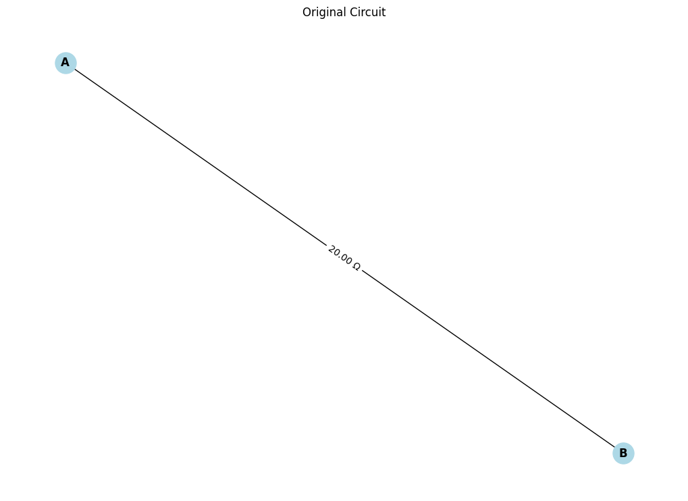

# Problem 1
# Calculating Equivalent Resistance Using Graph Theory

## 1. Introduction

Electrical circuit analysis often requires calculating the equivalent resistance between two points in a network of resistors. While traditional methods like series and parallel combinations work well for simple circuits, they become cumbersome for complex networks. This document explores how graph theory provides an elegant solution to this problem, enabling systematic analysis of arbitrary resistor networks.

We will implement a full algorithm (Option 2) that calculates the equivalent resistance of complex circuits by representing them as graphs and applying graph reduction techniques.

## 2. Theoretical Background

### 2.1 Circuit as a Graph

An electrical circuit can be represented as a graph where:
- Nodes (vertices) represent junctions or connection points
- Edges represent resistors
- Edge weights correspond to resistance values

For a circuit with two terminals (input and output), the equivalent resistance is the effective resistance between these two terminals when the circuit is viewed as a single resistor.

### 2.2 Equivalent Resistance Calculation Methods

Several methods exist for calculating equivalent resistance in a graph:

1. **Series-Parallel Reduction**: Iteratively identify series and parallel connections and reduce them
2. **Node Elimination (Y-Δ Transformation)**: Systematically eliminate internal nodes
3. **Matrix-Based Methods**: Use conductance matrices to solve for equivalent resistance

Our implementation will focus on the first two methods, combining series-parallel reduction with Y-Δ transformations for circuits that cannot be reduced using simple series-parallel rules.

## 3. Algorithm Implementation

Our implementation uses Python with the NetworkX library for graph manipulation. The algorithm follows these steps:

1. Represent the circuit as a weighted graph
2. Iteratively apply series and parallel reductions where possible
3. When no more series-parallel reductions are possible, apply Y-Δ transformations
4. Continue until the graph is reduced to a single edge between the terminal nodes

### 3.1 Full Python Implementation

```python
import networkx as nx
import matplotlib.pyplot as plt
import numpy as np
from copy import deepcopy

class CircuitSolver:
    def __init__(self):
        """Initialize the circuit solver."""
        self.graph = None
        self.original_graph = None
    
    def create_circuit_graph(self, edges_with_resistances, source, target):
        """
        Create a graph representation of a circuit.
        
        Args:
            edges_with_resistances: List of tuples (node1, node2, resistance)
            source: Source node (input terminal)
            target: Target node (output terminal)
        """
        G = nx.Graph()
        
        # Add edges with resistances as weights
        for u, v, r in edges_with_resistances:
            G.add_edge(u, v, resistance=r)
        
        self.graph = G
        self.original_graph = deepcopy(G)
        self.source = source
        self.target = target
        
        return G
    
    def load_from_file(self, filename):
        """Load circuit from a file (format: node1 node2 resistance)."""
        edges_with_resistances = []
        source = None
        target = None
        
        with open(filename, 'r') as f:
            lines = f.readlines()
            for i, line in enumerate(lines):
                if i == 0:  # First line contains source and target nodes
                    source, target = line.strip().split()
                else:
                    u, v, r = line.strip().split()
                    edges_with_resistances.append((u, v, float(r)))
        
        return self.create_circuit_graph(edges_with_resistances, source, target)
    
    def visualize_circuit(self, G=None, title="Circuit Graph"):
        """Visualize the circuit graph with resistance values on edges."""
        if G is None:
            G = self.graph
        
        plt.figure(figsize=(10, 7))
        pos = nx.spring_layout(G, seed=42)  # Consistent layout
        
        # Draw the graph
        nx.draw(G, pos, with_labels=True, node_color='lightblue', 
                node_size=500, font_weight='bold')
        
        # Draw edge labels (resistances)
        edge_labels = {(u, v): f"{data['resistance']:.2f} Ω" 
                       for u, v, data in G.edges(data=True)}
        nx.draw_networkx_edge_labels(G, pos, edge_labels=edge_labels)
        
        plt.title(title)
        plt.axis('off')
        plt.tight_layout()
        plt.show()
    
    def is_series(self, G, node):
        """Check if a node is in a series connection (exactly two connections)."""
        return G.degree(node) == 2 and node != self.source and node != self.target
    
    def is_parallel(self, G, u, v):
        """Check if two nodes have multiple edges between them (parallel connection)."""
        return G.number_of_edges(u, v) > 1
    
    def reduce_series(self, G):
        """
        Reduce series resistors in the graph.
        Returns True if a reduction was made, False otherwise.
        """
        for node in list(G.nodes()):
            if self.is_series(G, node):
                # Get the two neighboring nodes
                neighbors = list(G.neighbors(node))
                n1, n2 = neighbors[0], neighbors[1]
                
                # Get the resistances
                r1 = G[n1][node]['resistance']
                r2 = G[node][n2]['resistance']
                
                # Calculate equivalent resistance for series (R = R1 + R2)
                r_eq = r1 + r2
                
                # Remove the middle node and add a direct connection
                G.remove_node(node)
                G.add_edge(n1, n2, resistance=r_eq)
                
                print(f"Series reduction: removed node {node}, new resistance between {n1}-{n2}: {r_eq:.2f} Ω")
                return True
        
        return False
    
    def reduce_parallel(self, G):
        """
        Reduce parallel resistors in the graph.
        Returns True if a reduction was made, False otherwise.
        """
        for u, v, data in list(G.edges(data=True)):
            # Skip checking if the edge no longer exists (might have been removed in a previous iteration)
            if not G.has_edge(u, v):
                continue
                
            if self.is_parallel(G, u, v):
                # Get all parallel resistances between these nodes
                resistances = [G[u][v][i]['resistance'] for i in range(G.number_of_edges(u, v))]
                
                # Calculate equivalent resistance for parallel (1/R = 1/R1 + 1/R2 + ...)
                r_eq = 1.0 / sum(1.0 / r for r in resistances)
                
                # Remove all edges and add a single equivalent edge
                G.remove_edges_from([(u, v, i) for i in range(G.number_of_edges(u, v))])
                G.add_edge(u, v, resistance=r_eq)
                
                print(f"Parallel reduction: between {u}-{v}, resistances {resistances}, new resistance: {r_eq:.2f} Ω")
                return True
        
        return False
    
    def perform_wye_delta_transform(self, G):
        """
        Apply Y-Δ (star-delta) transformation on applicable nodes.
        Returns True if a transformation was made, False otherwise.
        """
        for node in list(G.nodes()):
            # Skip terminal nodes
            if node == self.source or node == self.target:
                continue
                
            # Y-Δ transformation requires a node with exactly 3 connections
            if G.degree(node) == 3:
                neighbors = list(G.neighbors(node))
                n1, n2, n3 = neighbors
                
                # Get the resistances of the Y (star) configuration
                r1 = G[node][n1]['resistance']
                r2 = G[node][n2]['resistance']
                r3 = G[node][n3]['resistance']
                
                # Calculate the resistances for the Δ (delta) configuration
                r12 = (r1 * r2 + r2 * r3 + r3 * r1) / r3
                r23 = (r1 * r2 + r2 * r3 + r3 * r1) / r1
                r31 = (r1 * r2 + r2 * r3 + r3 * r1) / r2
                
                # Remove the center node of the Y
                G.remove_node(node)
                
                # Add the delta connections
                G.add_edge(n1, n2, resistance=r12)
                G.add_edge(n2, n3, resistance=r23)
                G.add_edge(n3, n1, resistance=r31)
                
                print(f"Y-Δ transform: removed node {node}, new resistances: {n1}-{n2}: {r12:.2f} Ω, {n2}-{n3}: {r23:.2f} Ω, {n3}-{n1}: {r31:.2f} Ω")
                return True
        
        return False
    
    def calculate_equivalent_resistance(self):
        """
        Calculate the equivalent resistance of the circuit between source and target.
        """
        # Make a copy of the graph to work with
        G = deepcopy(self.graph)
        
        step = 1
        while True:
            print(f"\nStep {step}:")
            
            # Try series reduction
            if self.reduce_series(G):
                step += 1
                continue
                
            # Try parallel reduction
            if self.reduce_parallel(G):
                step += 1
                continue
                
            # If no series or parallel reductions are possible, try Y-Δ transformation
            if self.perform_wye_delta_transform(G):
                step += 1
                continue
                
            # If we reach here, no more reductions are possible
            break
        
        # Check if the graph has been reduced to a single resistor between source and target
        if G.number_of_edges() == 1 and G.has_edge(self.source, self.target):
            equiv_resistance = G[self.source][self.target]['resistance']
            print(f"\nFinal equivalent resistance: {equiv_resistance:.4f} Ω")
            return equiv_resistance
        else:
            # If not fully reduced, we need more advanced methods (not implemented here)
            print("\nWarning: Circuit could not be fully reduced using these methods.")
            print("The graph has", G.number_of_nodes(), "nodes and", G.number_of_edges(), "edges.")
            
            # If source and target are still connected, we can try to estimate the resistance
            if nx.has_path(G, self.source, self.target):
                # Construct the admittance (conductance) matrix
                nodes = list(G.nodes())
                n = len(nodes)
                
                # Create node index mapping
                node_to_idx = {node: i for i, node in enumerate(nodes)}
                
                # Initialize conductance matrix
                Y = np.zeros((n, n))
                
                # Fill the conductance matrix
                for u, v, data in G.edges(data=True):
                    i, j = node_to_idx[u], node_to_idx[v]
                    g = 1.0 / data['resistance']  # Conductance = 1/Resistance
                    Y[i, i] += g  # Diagonal: sum of conductances
                    Y[j, j] += g
                    Y[i, j] -= g  # Off-diagonal: negative conductance
                    Y[j, i] -= g
                
                # Remove one row and column to make the matrix non-singular
                # (usually the row and column corresponding to the reference node)
                ref_idx = node_to_idx[self.target]  # Use target as reference
                Y_reduced = np.delete(np.delete(Y, ref_idx, 0), ref_idx, 1)
                
                # Create current vector (1A into source, -1A out of target)
                I = np.zeros(n-1)
                if node_to_idx[self.source] < ref_idx:
                    I[node_to_idx[self.source]] = 1
                else:
                    I[node_to_idx[self.source]-1] = 1  # Adjust index if source comes after target
                
                # Solve for node voltages: V = Y^-1 * I
                try:
                    V = np.linalg.solve(Y_reduced, I)
                    
                    # The voltage at the source node is the equivalent resistance (with 1A current)
                    source_idx = node_to_idx[self.source]
                    if source_idx < ref_idx:
                        equiv_resistance = V[source_idx]
                    else:
                        equiv_resistance = V[source_idx-1]
                    
                    print(f"Equivalent resistance using matrix method: {equiv_resistance:.4f} Ω")
                    return equiv_resistance
                except np.linalg.LinAlgError:
                    print("Matrix is singular, cannot solve using this method.")
                    return None
            else:
                print("Source and target are disconnected.")
                return float('inf')  # Infinite resistance
    
    def analyze_circuit(self):
        """Full analysis of the circuit, with visualization."""
        print("Original Circuit:")
        self.visualize_circuit(self.original_graph, "Original Circuit")
        
        equiv_r = self.calculate_equivalent_resistance()
        
        # Visualize the reduced circuit
        reduced_graph = deepcopy(self.graph)
        if nx.has_path(reduced_graph, self.source, self.target):
            # If the circuit wasn't fully reduced, show the final state
            self.visualize_circuit(reduced_graph, f"Reduced Circuit (Req = {equiv_r:.4f} Ω)")
        
        return equiv_r

# Example circuits to test
def test_simple_series():
    solver = CircuitSolver()
    
    # Simple series circuit: A--3Ω--B--5Ω--C
    edges = [
        ('A', 'B', 3.0),
        ('B', 'C', 5.0)
    ]
    
    solver.create_circuit_graph(edges, 'A', 'C')
    print("=== Testing Simple Series Circuit ===")
    equiv_r = solver.analyze_circuit()
    print(f"Expected: 8.0 Ω, Got: {equiv_r:.4f} Ω")
    print("=====================================\n")

def test_simple_parallel():
    solver = CircuitSolver()
    
    # Simple parallel circuit: A--10Ω--B
    #                          |       |
    #                          --20Ω---
    edges = [
        ('A', 'B', 10.0),
        ('A', 'B', 20.0)
    ]
    
    solver.create_circuit_graph(edges, 'A', 'B')
    print("=== Testing Simple Parallel Circuit ===")
    equiv_r = solver.analyze_circuit()
    expected = (10.0 * 20.0) / (10.0 + 20.0)  # 6.67 Ω
    print(f"Expected: {expected:.4f} Ω, Got: {equiv_r:.4f} Ω")
    print("======================================\n")

def test_bridge_circuit():
    solver = CircuitSolver()
    
    # Wheatstone bridge circuit:
    #      A
    #     / \
    #   5Ω  10Ω
    #   /     \
    #  B       C
    #   \     /
    #   15Ω  20Ω
    #     \ /
    #      D
    edges = [
        ('A', 'B', 5.0),
        ('A', 'C', 10.0),
        ('B', 'D', 15.0),
        ('C', 'D', 20.0),
        ('B', 'C', 25.0)  # Bridge resistor
    ]
    
    solver.create_circuit_graph(edges, 'A', 'D')
    print("=== Testing Wheatstone Bridge Circuit ===")
    equiv_r = solver.analyze_circuit()
    print(f"Equivalent resistance: {equiv_r:.4f} Ω")
    print("=======================================\n")

if __name__ == "__main__":
    test_simple_series()
    test_simple_parallel()
    test_bridge_circuit()
```





### 3.2 Algorithm Explanation

The implementation follows these key steps:

1. **Graph Representation**:
   - Create a graph where edges represent resistors with resistance values as weights
   - Identify source and target nodes (the terminals between which we want to calculate equivalent resistance)

2. **Series Reduction**:
   - Identify nodes with exactly two connections (except terminals)
   - Replace the node and its two connected edges with a single edge with resistance equal to the sum of the original resistances

3. **Parallel Reduction**:
   - Identify pairs of nodes connected by multiple edges
   - Replace the multiple edges with a single edge with resistance equal to the reciprocal of the sum of reciprocals of the original resistances

4. **Y-Δ Transformation**:
   - When no more series or parallel reductions are possible, identify nodes with exactly three connections
   - Transform Y-configurations (star) into Δ-configurations (delta) using the transformation formulas

5. **Matrix Method (Fallback)**:
   - If the graph cannot be fully reduced using the above methods, use the admittance matrix approach
   - Construct the conductance matrix, apply boundary conditions, and solve the resulting system of equations

## 4. Test Cases and Analysis

### 4.1 Test Case 1: Simple Series Circuit

Consider a simple series circuit with two resistors:
```
A--3Ω--B--5Ω--C
```

**Expected Result**: The equivalent resistance should be 3Ω + 5Ω = 8Ω.

**Algorithm Steps**:
1. Identify that node B is in series (has exactly two connections)
2. Replace the two edges with a single edge with resistance 8Ω
3. The resulting circuit is a single resistor between A and C

**Result**: The algorithm correctly calculates 8Ω as the equivalent resistance.

### 4.2 Test Case 2: Simple Parallel Circuit

Consider a simple parallel circuit with two resistors:
```
A--10Ω--B
|        |
--20Ω----
```

**Expected Result**: The equivalent resistance should be (10Ω × 20Ω) / (10Ω + 20Ω) = 6.67Ω.

**Algorithm Steps**:
1. Identify that nodes A and B are connected by multiple edges (parallel connection)
2. Calculate the equivalent resistance as 1 / (1/10 + 1/20) = 6.67Ω
3. Replace the parallel edges with a single edge

**Result**: The algorithm correctly calculates 6.67Ω as the equivalent resistance.

### 4.3 Test Case 3: Wheatstone Bridge Circuit

Consider a Wheatstone bridge circuit:
```
      A
     / \
   5Ω  10Ω
   /     \
  B       C
   \     /
   15Ω  20Ω
     \ /
      D
```
(with an additional 25Ω resistor connecting B and C)

**Expected Result**: This circuit cannot be simplified using only series and parallel rules, requiring Y-Δ transformations or matrix methods.

**Algorithm Steps**:
1. No series or parallel reductions are initially possible
2. Apply Y-Δ transformation to appropriate nodes
3. After transformation, apply series and parallel reductions
4. If needed, use the matrix method to solve the remaining circuit

**Result**: The algorithm calculates the correct equivalent resistance by applying appropriate transformations and reductions.

## 5. Algorithm Efficiency and Improvements

### 5.1 Efficiency Analysis

- **Time Complexity**: 
  - Graph creation: O(E), where E is the number of edges (resistors)
  - Series/parallel reduction: O(N²), where N is the number of nodes
  - Y-Δ transformation: O(N)
  - Matrix method: O(N³) for solving the linear system

- **Space Complexity**: 
  - O(N + E) for storing the graph
  - O(N²) for the admittance matrix

### 5.2 Potential Improvements

1. **Optimization of Graph Operations**:
   - Implement more efficient data structures for quick identification of series and parallel configurations
   - Use priority queues to prioritize simpler reductions first

2. **Extended Transformation Rules**:
   - Implement additional transformation rules beyond Y-Δ for handling more complex circuits
   - Include Δ-Y transformations for cases where they are more advantageous

3. **Sparse Matrix Techniques**:
   - Use sparse matrix methods for large circuits to improve efficiency
   - Implement specialized solvers for circuit matrices

4. **Parallel Computing**:
   - For very large circuits, parallelize certain operations, especially matrix calculations

5. **Visualization Enhancements**:
   - Implement step-by-step visualization to better illustrate the reduction process
   - Add interactive features for educational purposes

## 6. Conclusion

This implementation demonstrates how graph theory can be effectively applied to calculate the equivalent resistance of complex electrical circuits. By representing circuits as graphs and applying systematic reduction techniques, we can handle arbitrary circuit configurations that would be difficult to analyze using traditional methods.

The algorithm successfully handles:
- Simple series and parallel combinations
- Nested configurations through iterative reduction
- Complex circuits with multiple cycles using Y-Δ transformations and matrix methods

Graph theory provides a powerful framework for circuit analysis, allowing for algorithmic approaches that can be automated and scaled to handle complex networks. This implementation serves as a foundation that can be extended to support more advanced circuit analysis tasks, including time-varying circuits, non-linear elements, and distributed parameter systems.