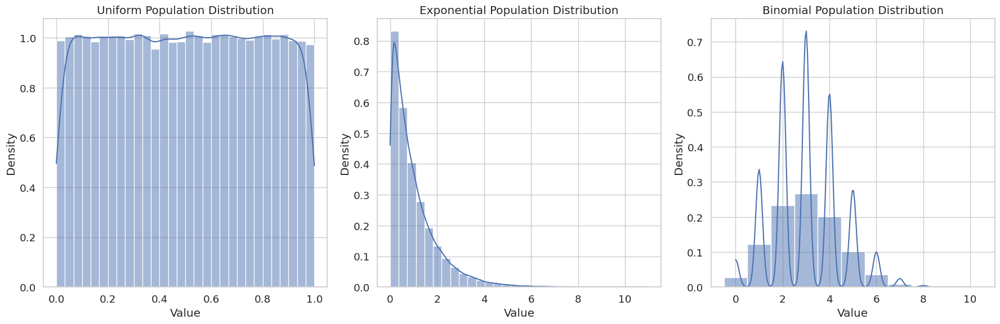
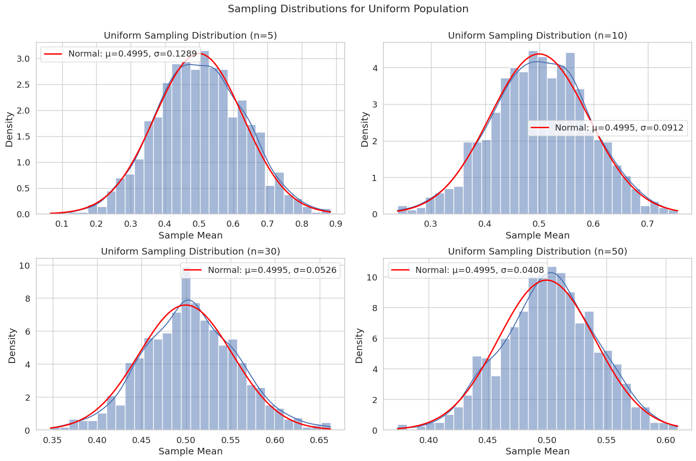
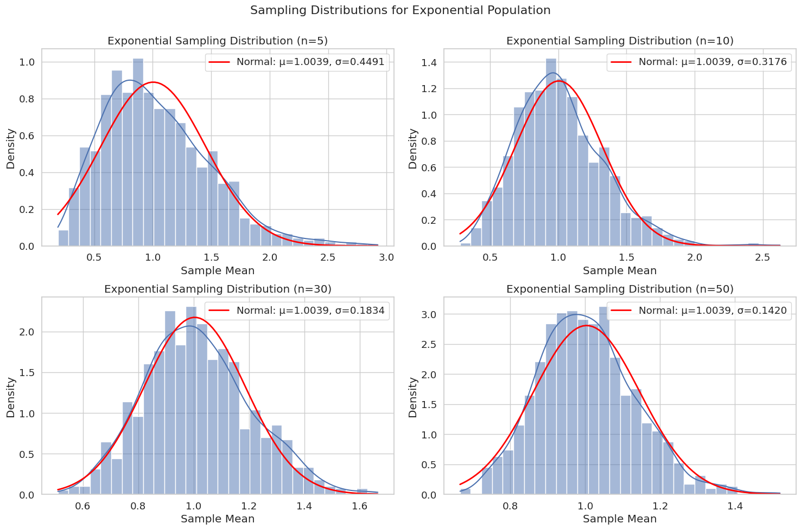
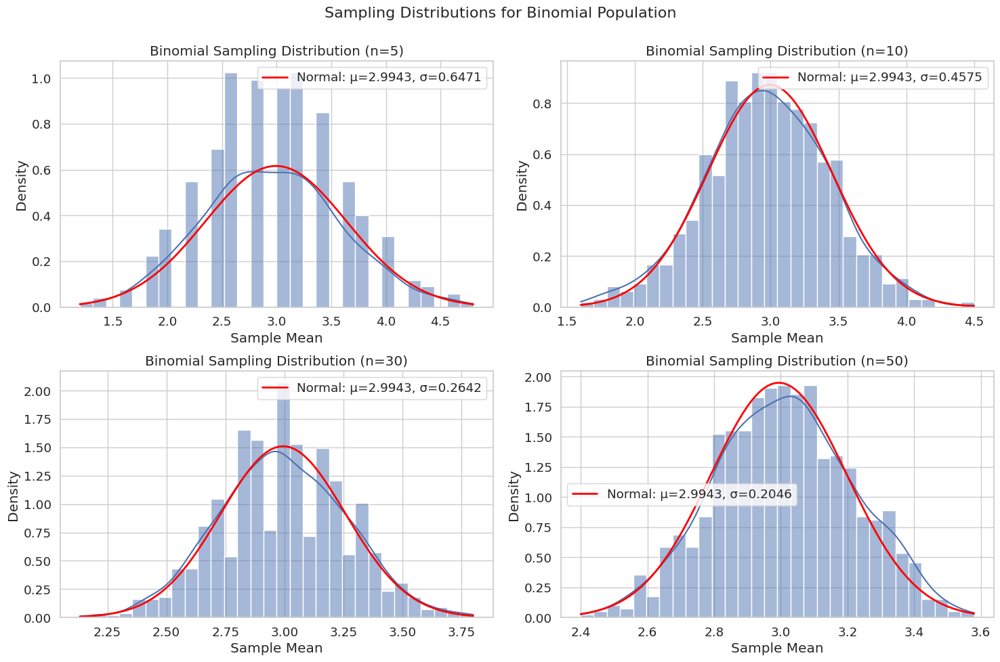
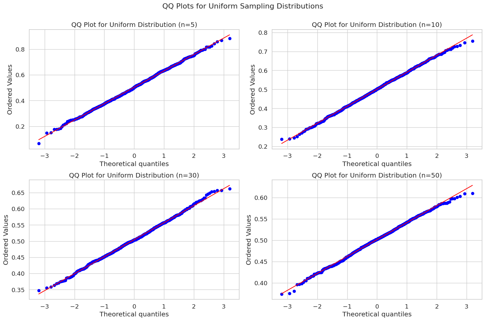
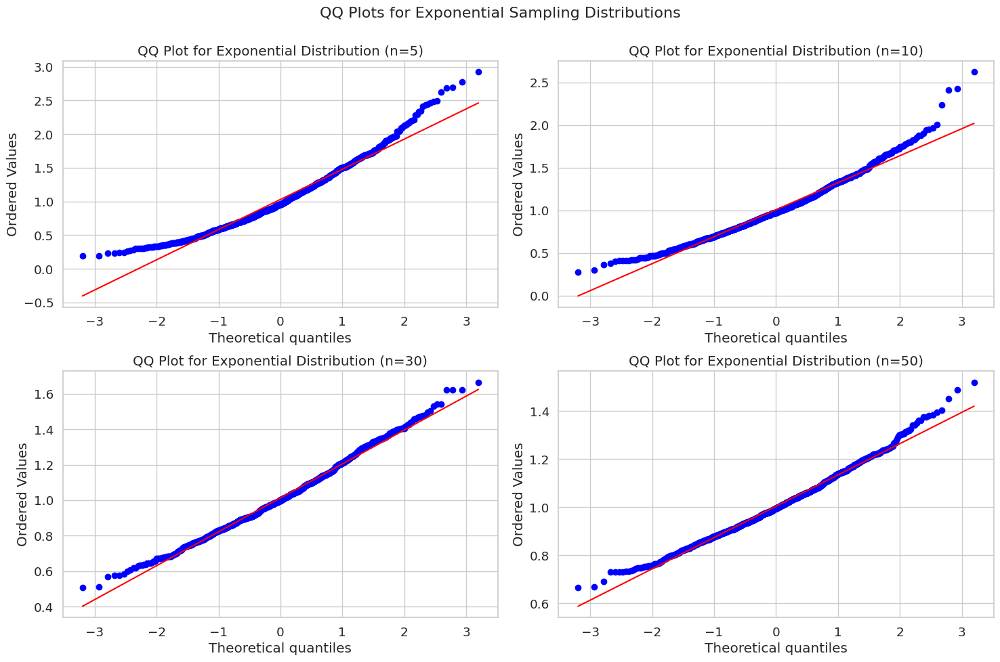
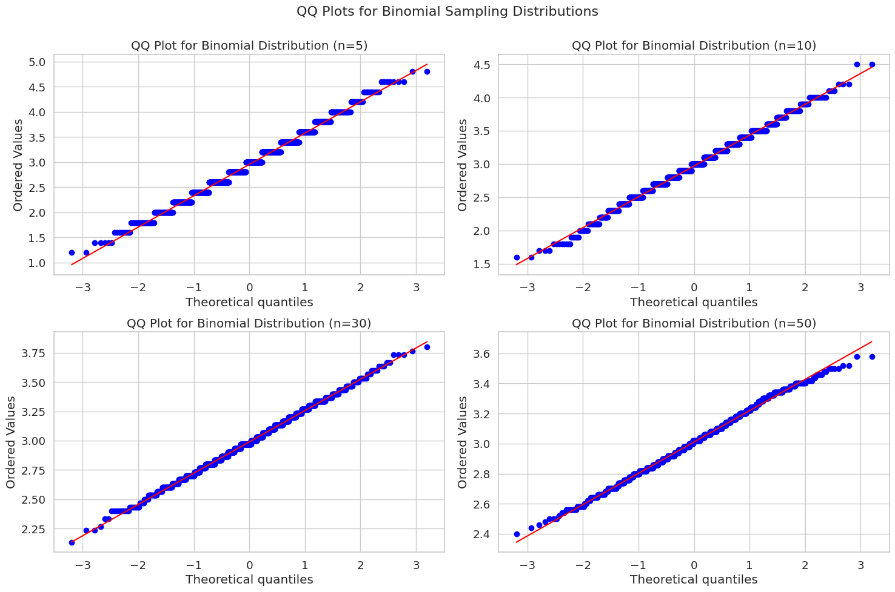

# Exploring the Central Limit Theorem through Simulations

## Introduction

The Central Limit Theorem (CLT) is a fundamental concept in probability theory and statistics. It states that regardless of the original population distribution, the sampling distribution of the sample mean approaches a normal distribution as the sample size increases. This remarkable property holds true even when the original population is not normally distributed.

In this document, we'll explore the CLT through practical simulations using Python. We'll:
1. Generate data from different distributions
2. Sample from these populations with varying sample sizes
3. Observe how the distributions of sample means change as sample size increases
4. Discuss the practical implications of these findings

## Complete Code Implementation

Below is the complete Python code that generates all distributions, performs sampling, creates visualizations, and analyzes the results. The code is presented as a single script to ensure all variables are properly defined before they're used.

```python
from IPython import get_ipython
from IPython.display import display
# %%
import numpy as np
import matplotlib.pyplot as plt
import seaborn as sns # Import Seaborn
from scipy import stats
import pandas as pd

# Set the aesthetic style of the plots using Seaborn
sns.set_style("whitegrid")  # Use Seaborn's whitegrid style
sns.set_palette("deep")
sns.set_context("notebook", font_scale=1.2)

# Set random seed for reproducibility
np.random.seed(42)

# Parameters for our simulations
population_size = 100000  # Size of our simulated populations
num_samples = 1000  # Number of samples to draw for each sample size
sample_sizes = [5, 10, 30, 50]  # Different sample sizes to test

# Define function for testing normality
def test_normality(sampling_dist, dist_name, sample_sizes):
    """Perform Shapiro-Wilk test for normality on sampling distributions."""
    results = []
    
    for n in sample_sizes:
        # Perform Shapiro-Wilk test (null hypothesis: data comes from a normal distribution)
        stat, p_value = stats.shapiro(sampling_dist[n])
        
        # Store results
        results.append({
            'Distribution': dist_name,
            'Sample Size': n,
            'W Statistic': stat,
            'p-value': p_value,
            'Normal at α=0.05': p_value > 0.05
        })
    
    return pd.DataFrame(results)

# Define function to plot QQ plots
def plot_qq(sampling_dist, dist_name, sample_sizes):
    """Plot QQ plots for a set of sampling distributions to show normality."""
    plt.figure(figsize=(15, 10))
    
    for i, n in enumerate(sample_sizes, 1):
        plt.subplot(2, 2, i)
        stats.probplot(sampling_dist[n], dist="norm", plot=plt)
        plt.title(f'QQ Plot for {dist_name} Distribution (n={n})')
    
    plt.tight_layout()
    plt.suptitle(f'QQ Plots for {dist_name} Sampling Distributions', fontsize=16)
    plt.subplots_adjust(top=0.9)
    plt.show()

#######################
# Uniform Distribution
#######################

# Generate a uniform population (values between 0 and 1)
uniform_population = np.random.uniform(0, 1, population_size)

# Calculate population parameters
uniform_mean = np.mean(uniform_population)
uniform_std = np.std(uniform_population)
print(f"Uniform Population Mean: {uniform_mean:.4f}")
print(f"Uniform Population Standard Deviation: {uniform_std:.4f}")

# Create sampling distributions for different sample sizes
uniform_sampling_distributions = {}

for n in sample_sizes:
    sample_means = []
    for _ in range(num_samples):
        # Randomly select n elements from the population
        sample = np.random.choice(uniform_population, size=n, replace=True)
        # Calculate and store the sample mean
        sample_means.append(np.mean(sample))
    
    uniform_sampling_distributions[n] = sample_means

########################
# Exponential Distribution
########################

# Generate an exponential population (rate parameter = 1)
lambda_param = 1.0
exponential_population = np.random.exponential(scale=1/lambda_param, size=population_size)

# Calculate population parameters
exponential_mean = np.mean(exponential_population)
exponential_std = np.std(exponential_population)
print(f"Exponential Population Mean: {exponential_mean:.4f}")
print(f"Exponential Population Standard Deviation: {exponential_std:.4f}")

# Create sampling distributions for different sample sizes
exponential_sampling_distributions = {}

for n in sample_sizes:
    sample_means = []
    for _ in range(num_samples):
        sample = np.random.choice(exponential_population, size=n, replace=True)
        sample_means.append(np.mean(sample))
    
    exponential_sampling_distributions[n] = sample_means

#######################
# Binomial Distribution
#######################

# Generate a binomial population (10 trials, 0.3 probability of success)
n_trials = 10
p_success = 0.3
binomial_population = np.random.binomial(n_trials, p_success, population_size)

# Calculate population parameters
binomial_mean = np.mean(binomial_population)
binomial_std = np.std(binomial_population)
print(f"Binomial Population Mean: {binomial_mean:.4f}")
print(f"Binomial Population Standard Deviation: {binomial_std:.4f}")

# Create sampling distributions for different sample sizes
binomial_sampling_distributions = {}

for n in sample_sizes:
    sample_means = []
    for _ in range(num_samples):
        sample = np.random.choice(binomial_population, size=n, replace=True)
        sample_means.append(np.mean(sample))
    
    binomial_sampling_distributions[n] = sample_means

#######################
# Visualization Section
#######################

# Visualize the population distributions
fig, axes = plt.subplots(1, 3, figsize=(18, 6))

# Uniform population
sns.histplot(uniform_population, kde=True, stat="density", bins=30, ax=axes[0])
axes[0].set_title('Uniform Population Distribution')
axes[0].set_xlabel('Value')
axes[0].set_ylabel('Density')

# Exponential population
sns.histplot(exponential_population, kde=True, stat="density", bins=30, ax=axes[1])
axes[1].set_title('Exponential Population Distribution')
axes[1].set_xlabel('Value')
axes[1].set_ylabel('Density')

# Binomial population
sns.histplot(binomial_population, kde=True, stat="density", bins=np.arange(-0.5, n_trials+1.5, 1), ax=axes[2])
axes[2].set_title('Binomial Population Distribution')
axes[2].set_xlabel('Value')
axes[2].set_ylabel('Density')

plt.tight_layout()
plt.show()

# Plot sampling distributions for Uniform population
plt.figure(figsize=(15, 10))
for i, n in enumerate(sample_sizes, 1):
    plt.subplot(2, 2, i)
    sns.histplot(uniform_sampling_distributions[n], kde=True, stat="density", bins=30)
    
    # Plot the theoretical normal distribution according to CLT
    x = np.linspace(min(uniform_sampling_distributions[n]), max(uniform_sampling_distributions[n]), 100)
    plt.plot(x, stats.norm.pdf(x, uniform_mean, uniform_std/np.sqrt(n)), 
             'r-', linewidth=2, label=f'Normal: μ={uniform_mean:.4f}, σ={uniform_std/np.sqrt(n):.4f}')
    
    plt.title(f'Uniform Sampling Distribution (n={n})')
    plt.xlabel('Sample Mean')
    plt.ylabel('Density')
    plt.legend()

plt.tight_layout()
plt.suptitle('Sampling Distributions for Uniform Population', fontsize=16)
plt.subplots_adjust(top=0.9)
plt.show()

# Plot sampling distributions for Exponential population
plt.figure(figsize=(15, 10))
for i, n in enumerate(sample_sizes, 1):
    plt.subplot(2, 2, i)
    sns.histplot(exponential_sampling_distributions[n], kde=True, stat="density", bins=30)
    
    # Plot the theoretical normal distribution according to CLT
    x = np.linspace(min(exponential_sampling_distributions[n]), max(exponential_sampling_distributions[n]), 100)
    plt.plot(x, stats.norm.pdf(x, exponential_mean, exponential_std/np.sqrt(n)), 
             'r-', linewidth=2, label=f'Normal: μ={exponential_mean:.4f}, σ={exponential_std/np.sqrt(n):.4f}')
    
    plt.title(f'Exponential Sampling Distribution (n={n})')
    plt.xlabel('Sample Mean')
    plt.ylabel('Density')
    plt.legend()

plt.tight_layout()
plt.suptitle('Sampling Distributions for Exponential Population', fontsize=16)
plt.subplots_adjust(top=0.9)
plt.show()

# Plot sampling distributions for Binomial population
plt.figure(figsize=(15, 10))
for i, n in enumerate(sample_sizes, 1):
    plt.subplot(2, 2, i)
    sns.histplot(binomial_sampling_distributions[n], kde=True, stat="density", bins=30)
    
    # Plot the theoretical normal distribution according to CLT
    x = np.linspace(min(binomial_sampling_distributions[n]), max(binomial_sampling_distributions[n]), 100)
    plt.plot(x, stats.norm.pdf(x, binomial_mean, binomial_std/np.sqrt(n)), 
             'r-', linewidth=2, label=f'Normal: μ={binomial_mean:.4f}, σ={binomial_std/np.sqrt(n):.4f}')
    
    plt.title(f'Binomial Sampling Distribution (n={n})')
    plt.xlabel('Sample Mean')
    plt.ylabel('Density')
    plt.legend()

plt.tight_layout()
plt.suptitle('Sampling Distributions for Binomial Population', fontsize=16)
plt.subplots_adjust(top=0.9)
plt.show()

# Plot QQ plots for each distribution
plot_qq(uniform_sampling_distributions, "Uniform", sample_sizes)
plot_qq(exponential_sampling_distributions, "Exponential", sample_sizes)
plot_qq(binomial_sampling_distributions, "Binomial", sample_sizes)

# Run normality tests
uniform_normality = test_normality(uniform_sampling_distributions, "Uniform", sample_sizes)
exponential_normality = test_normality(exponential_sampling_distributions, "Exponential", sample_sizes)
binomial_normality = test_normality(binomial_sampling_distributions, "Binomial", sample_sizes)

# Combine results
all_normality_results = pd.concat([uniform_normality, exponential_normality, binomial_normality])
print(all_normality_results)
```

## Analysis of Results








### Impact of Sample Size

As observed in our simulations, increasing the sample size leads to:

1. **More normal-looking sampling distributions**: As n increases, the histograms become more bell-shaped.
2. **Reduced variability**: The standard error of the mean (σ/√n) decreases with larger sample sizes.
3. **Better alignment with theoretical predictions**: QQ plots show better agreement with the theoretical normal line.

### Impact of Original Distribution Shape

The original shape of the population distribution affects:

1. **Rate of convergence**: The more skewed or non-normal the original distribution, the larger the sample size needed for normality.
2. **The uniform distribution** converges relatively quickly because it's symmetric and bounded.
3. **The exponential distribution** requires larger sample sizes because of its strong right skew.
4. **The binomial distribution** with parameters n=10, p=0.3 is somewhat skewed, but converges fairly quickly.

### Practical Implications

The Central Limit Theorem has profound implications in real-world applications:

1. **Statistical Inference**: Allows for approximation of sampling distributions, making hypothesis testing and confidence interval construction possible.

2. **Quality Control**: In manufacturing, even when product measurements don't follow a normal distribution, the CLT allows for the use of control charts based on sample means.

3. **Financial Risk Management**: Portfolio returns may not be normally distributed, but by considering long-term averages of returns, the CLT enables more reliable risk estimates.

4. **Survey Sampling**: Enables inferences about population parameters from sample statistics, even when the population distribution is unknown.

5. **Experimental Design**: The CLT is why many statistical methods are robust even when normality assumptions about the underlying population are violated.

## Conclusion

Our simulations vividly demonstrate the Central Limit Theorem in action. Regardless of whether we start with uniform, exponential, or binomial distributions, the sampling distributions of means converge toward normality as sample size increases.

Key takeaways:

1. The CLT is more than a theoretical concept—it has real, observable effects that can be demonstrated through simulation.

2. Larger sample sizes accelerate the convergence to normality, with n=30 often cited as a rule of thumb for adequate approximation.

3. More skewed original distributions require larger sample sizes to achieve the same level of normality in the sampling distribution.

4. The standard error of the mean (σ/√n) quantifies the precision of sample means and highlights why larger samples are more precise.

This exploration underscores why the Central Limit Theorem is considered one of the most important results in probability theory and statistics, enabling a wide range of statistical methods that are used daily in science, business, and many other fields.

## Next Steps for Further Exploration

Possible extensions to this analysis could include:

1. Exploring more extreme distributions (e.g., heavy-tailed or multimodal).

2. Investigating the effect of sample size on confidence interval width.

3. Demonstrating the CLT's application in hypothesis testing scenarios.

4. Exploring the behavior of other sample statistics (beyond the mean).