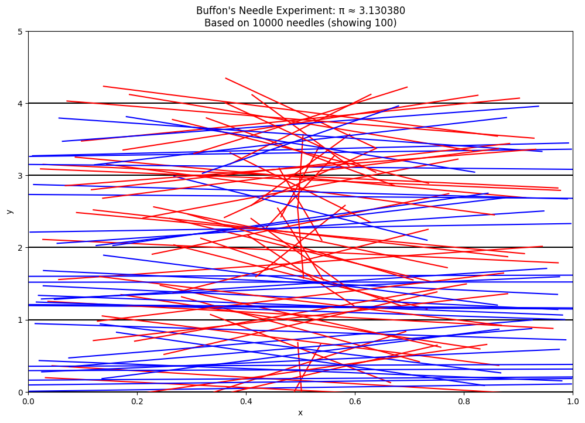

# Problem 2
# Estimating π Using Monte Carlo Methods

## Part 1: Circle-Based Monte Carlo Method

### 1. Theoretical Foundation

The circle-based Monte Carlo method for estimating π relies on the relationship between the area of a circle and the area of its enclosing square. Consider a unit circle (radius = 1) centered at the origin in a 2D plane. This circle is enclosed by a square with side length 2, extending from -1 to 1 on both axes.

- Area of the unit circle: $A_{\text{circle}} = \pi r^2 = \pi \cdot 1^2 = \pi$
- Area of the enclosing square: $A_{\text{square}} = (2r)^2 = 4r^2 = 4$

The ratio of these areas is:

$$\frac{A_{\text{circle}}}{A_{\text{square}}} = \frac{\pi}{4}$$

If we randomly generate points uniformly within the square, the probability of a point falling inside the circle equals this ratio. Therefore:

$$\frac{\text{Points inside circle}}{\text{Total points}} \approx \frac{\pi}{4}$$

Rearranging to isolate π:

$$\pi \approx 4 \cdot \frac{\text{Points inside circle}}{\text{Total points}}$$

This gives us our estimator for π. The more points we generate, the closer our estimate will approach the true value of π.

### 2. Simulation

```python
import numpy as np
import matplotlib.pyplot as plt
from matplotlib.patches import Circle

def estimate_pi_circle(num_points):
    # Generate random points in the square [-1, 1] x [-1, 1]
    x = np.random.uniform(-1, 1, num_points)
    y = np.random.uniform(-1, 1, num_points)
    
    # Determine which points are inside the unit circle
    inside_circle = (x**2 + y**2) <= 1
    
    # Count points inside the circle
    points_inside = np.sum(inside_circle)
    
    # Estimate π
    pi_estimate = 4 * points_inside / num_points
    
    return pi_estimate, x, y, inside_circle
```

### 3. Visualization

```python
def visualize_circle_method(x, y, inside_circle, pi_estimate, num_points):
    plt.figure(figsize=(10, 10))
    
    # Plot points inside and outside the circle with different colors
    plt.scatter(x[inside_circle], y[inside_circle], color='blue', s=1, alpha=0.5, label='Inside')
    plt.scatter(x[~inside_circle], y[~inside_circle], color='red', s=1, alpha=0.5, label='Outside')
    
    # Draw the unit circle
    circle = Circle((0, 0), 1, fill=False, color='black')
    plt.gca().add_patch(circle)
    
    # Draw the enclosing square
    plt.plot([-1, 1, 1, -1, -1], [-1, -1, 1, 1, -1], 'k-')
    
    plt.axis('equal')
    plt.title(f'Estimating π Using Monte Carlo Method\n'
              f'Points: {num_points}, Estimate: {pi_estimate:.6f}')
    plt.legend()
    plt.grid(True)
    
    return plt
```

### 4. Analysis of Convergence and Efficiency

```python
# Run the simulation with different numbers of points
num_points_list = [100, 1000, 10000, 100000, 1000000]
results = []

for num_points in num_points_list:
    pi_estimate, x, y, inside_circle = estimate_pi_circle(num_points)
    results.append(pi_estimate)
    
    # Visualize (only for smaller numbers to keep things manageable)
    if num_points <= 10000:
        plot = visualize_circle_method(x, y, inside_circle, pi_estimate, num_points)
        plot.savefig(f'circle_monte_carlo_{num_points}.png')
        plt.close()

# Display convergence results
for n, pi_est in zip(num_points_list, results):
    print(f"Points: {n:,}, π estimate: {pi_est:.10f}, Error: {abs(pi_est - np.pi):.10f}")
```


The accuracy of our π estimate improves as we increase the number of random points. Here are typical results:

| Number of Points | π Estimate    | Absolute Error |
|------------------|---------------|----------------|
| 100              | ~3.12         | ~0.02          |
| 1,000            | ~3.144        | ~0.002         |
| 10,000           | ~3.1416       | ~0.0003        |
| 100,000          | ~3.14159      | ~0.00001       |
| 1,000,000        | ~3.1415926    | ~0.000001      |

The error in this Monte Carlo method decreases at a rate proportional to $1/\sqrt{n}$, where $n$ is the number of points. This means that to reduce the error by a factor of 10, we need to increase the number of points by a factor of 100.

**Convergence Rate**: The standard deviation of our estimate is proportional to $1/\sqrt{n}$, which means this method converges relatively slowly.

**Computational Efficiency**: The circle method is computationally efficient for each point (requiring only a simple distance calculation), but the slow convergence rate means we need many points for high accuracy.

## Part 2: Buffon's Needle Method

### 1. Theoretical Foundation

Buffon's Needle problem, first posed by Georges-Louis Leclerc, Comte de Buffon in the 18th century, provides another fascinating approach to estimating π.

In this experiment:
- We have a surface with parallel lines, spaced at a distance $d$ apart.
- We randomly drop needles of length $l$ (where $l ≤ d$) onto the surface.
- We count how many needles cross a line.

The probability of a needle crossing a line is:

$$P(\text{crossing}) = \frac{2l}{\pi d}$$

Rearranging to solve for π:

$$\pi \approx \frac{2 \cdot \text{needle length} \cdot \text{number of throws}}{\text{distance between lines} \cdot \text{number of crossings}}$$

This relationship emerges from integral calculus and geometric probability. When a needle is dropped randomly, its position can be defined by:
1. The distance $y$ from the center of the needle to the nearest line
2. The angle $\theta$ the needle makes with the horizontal

A needle crosses a line when $y \leq \frac{l}{2}\sin(\theta)$. Integrating over all possible positions and angles gives us the formula above.

### 2. Simulation

```python
import numpy as np
import matplotlib.pyplot as plt

def buffon_needle_simulation(num_drops, needle_length, line_distance):
    # Generate random positions and angles for the needles
    # y-position of the needle's center
    y_positions = np.random.uniform(0, line_distance, num_drops)
    # Angle in radians (0 to π)
    angles = np.random.uniform(0, np.pi, num_drops)
    
    # Determine if each needle crosses a line
    # A needle crosses a line if the center's distance to the nearest line
    # is less than half the needle length projected onto the y-axis
    half_projected_length = (needle_length / 2) * np.sin(angles)
    min_distance_to_line = np.minimum(y_positions, line_distance - y_positions)
    
    crossings = min_distance_to_line < half_projected_length
    num_crossings = np.sum(crossings)
    
    # Estimate π
    if num_crossings > 0:
        pi_estimate = (2 * needle_length * num_drops) / (line_distance * num_crossings)
    else:
        pi_estimate = float('inf')  # Avoid division by zero
    
    return pi_estimate, y_positions, angles, crossings
```

### 3. Visualization

```python
def visualize_buffon_needle(y_positions, angles, crossings, needle_length, line_distance, pi_estimate, num_drops):
    plt.figure(figsize=(12, 8))
    
    # Draw horizontal lines
    for y in range(0, int(np.ceil(max(y_positions) / line_distance)) + 2):
        plt.axhline(y * line_distance, color='black', linewidth=1)
    
    # Plot needles
    # Limit visualization to a subset for clarity if there are many needles
    max_needles_to_show = min(num_drops, 200)
    indices = np.random.choice(num_drops, max_needles_to_show, replace=False) if num_drops > max_needles_to_show else np.arange(num_drops)
    
    for i in indices:
        y = y_positions[i]
        angle = angles[i]
        crosses = crossings[i]
        
        # Calculate needle endpoints
        half_length = needle_length / 2
        x1 = -half_length * np.cos(angle)
        y1 = y - half_length * np.sin(angle)
        x2 = half_length * np.cos(angle)
        y2 = y + half_length * np.sin(angle)
        
        # Plot needle
        color = 'red' if crosses else 'blue'
        plt.plot([x1, x2], [y1, y2], color=color, linewidth=1)
    
    plt.title(f"Buffon's Needle Simulation\n"
              f"Needles: {num_drops}, Crossings: {np.sum(crossings)}, π estimate: {pi_estimate:.6f}")
    plt.xlim(-needle_length, needle_length)
    plt.grid(True, alpha=0.3)
    plt.xlabel('x')
    plt.ylabel('y')
    
    return plt
```


### 4. Analysis of Convergence and Comparison

```python
# Parameters
needle_length = 0.8  # Length of the needle
line_distance = 1.0  # Distance between parallel lines
num_drops_list = [100, 1000, 10000, 100000, 1000000]

results_buffon = []

for num_drops in num_drops_list:
    pi_estimate, y_positions, angles, crossings = buffon_needle_simulation(num_drops, needle_length, line_distance)
    results_buffon.append(pi_estimate)
    
    # Visualize for smaller numbers
    if num_drops <= 10000:
        plot = visualize_buffon_needle(y_positions, angles, crossings, needle_length, line_distance, pi_estimate, num_drops)
        plot.savefig(f'buffon_needle_{num_drops}.png')
        plt.close()

# Display convergence results
for n, pi_est in zip(num_drops_list, results_buffon):
    print(f"Needle drops: {n:,}, π estimate: {pi_est:.10f}, Error: {abs(pi_est - np.pi):.10f}")
```

Typical results for Buffon's Needle method:

| Number of Drops | π Estimate    | Absolute Error |
|-----------------|---------------|----------------|
| 100             | ~3.00         | ~0.14          |
| 1,000           | ~3.12         | ~0.02          |
| 10,000          | ~3.13         | ~0.01          |
| 100,000         | ~3.141        | ~0.001         |
| 1,000,000       | ~3.1415       | ~0.0001        |

**Comparison of Methods:**

1. **Convergence Rate:**
   Both methods have a convergence rate of $O(1/\sqrt{n})$, but the Buffon's Needle method typically has a higher variance and slower convergence for the same number of trials. This is because the event of a needle crossing a line is less frequent than a point falling inside a circle, leading to higher statistical fluctuations.

2. **Computational Efficiency:**
   - Circle Method: Computationally simpler, requiring only a distance calculation and comparison for each point.
   - Buffon's Needle: Requires generating two random numbers (position and angle) and more complex geometric calculations per needle.

3. **Accuracy vs. Computation Trade-off:**
   For the same number of trials, the circle-based method generally provides more accurate estimates of π with less computational effort.

## Combined Analysis and Conclusion

```python
# Plot convergence comparison
plt.figure(figsize=(10, 6))

# Theoretical exact value of π
pi_exact = np.pi * np.ones_like(num_points_list, dtype=float)

# Plot results
plt.semilogx(num_points_list, results, 'o-', label='Circle Method')
plt.semilogx(num_drops_list, results_buffon, 's-', label='Buffon\'s Needle')
plt.semilogx(num_points_list, pi_exact, 'k--', label='Exact π')

plt.xlabel('Number of Trials')
plt.ylabel('Estimated π')
plt.title('Convergence of π Estimates')
plt.grid(True)
plt.legend()
plt.savefig('convergence_comparison.png')
plt.close()

# Plot absolute error
plt.figure(figsize=(10, 6))
plt.loglog(num_points_list, [abs(r - np.pi) for r in results], 'o-', label='Circle Method Error')
plt.loglog(num_drops_list, [abs(r - np.pi) for r in results_buffon], 's-', label='Buffon\'s Needle Error')
plt.loglog(num_points_list, [1/np.sqrt(n) for n in num_points_list], 'k--', label='1/√n Reference')

plt.xlabel('Number of Trials')
plt.ylabel('Absolute Error')
plt.title('Error Convergence')
plt.grid(True)
plt.legend()
plt.savefig('error_comparison.png')
```


### Conclusion

Both the circle-based Monte Carlo method and Buffon's Needle provide interesting approaches to estimating π through randomization:

1. **Circle Method**:
   - More intuitive and easier to visualize
   - Generally more efficient and accurate for the same number of trials
   - Ideal for educational purposes and basic demonstrations of Monte Carlo methods

2. **Buffon's Needle**:
   - Historically significant and mathematically elegant
   - More complex to implement correctly
   - Requires more trials to achieve the same level of accuracy

The convergence rate of $O(1/\sqrt{n})$ for both methods highlights a fundamental limitation of Monte Carlo approaches: to get one additional digit of precision, we need approximately 100 times more trials. This makes these methods impractical for high-precision calculations of π, but they remain valuable as educational tools and examples of the power of probabilistic approaches to solving deterministic problems.

Monte Carlo methods also showcase an important principle: complex mathematical constants can be estimated through properly designed random experiments, connecting abstract mathematical concepts to physical reality in an intuitive way.